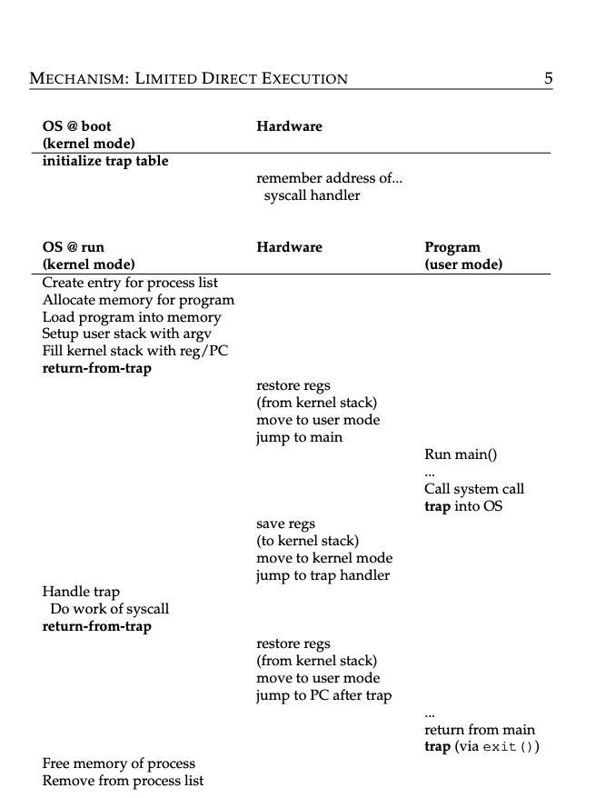

### Key Notes on Limited Direct Execution (LDE) and Restricted Operations

#### **Problem: Restricted Operations**

- **Challenge**: Processes need to perform restricted operations (e.g., I/O requests, resource access) without having complete control over the system.
- **Solution**: Use hardware and OS mechanisms to allow restricted operations while maintaining system control and security.

---

#### **Key Mechanisms in LDE**

1. **User Mode vs. Kernel Mode**:
    
    - **User Mode**: Restricted access; processes cannot perform privileged operations (e.g., I/O requests).
    - **Kernel Mode**: Full access to hardware resources; OS performs privileged operations.
2. **System Calls**:
    
    - Allow user programs to request restricted operations from the OS.
    - Executed via a **trap instruction**, which:
        - Switches the CPU to kernel mode.
        - Jumps to predefined kernel code (trap handler).
    - After execution, the OS uses a **return-from-trap instruction** to:
        - Restore user-mode registers.
        - Return control to the user program.
3. **Trap Table**:
    
    - Configured by the OS at boot time (in kernel mode).
    - Maps specific events (e.g., system calls, interrupts) to corresponding kernel code.
    - Prevents user processes from directly specifying kernel addresses (ensures security).
4. **System Call Workflow**:
    
    - User program calls a system call (e.g., `open()` or `read()`).
    - C library translates the call into a trap instruction with:
        - System call number in a register or stack.
        - Arguments in well-known locations.
    - Trap instruction:
        - Saves user program state (e.g., registers, program counter) to the kernel stack.
        - Switches to kernel mode and jumps to the trap handler.
    - Kernel validates the system call number and arguments, performs the operation, and returns control to the user program.

---

#### **Advantages of LDE**

- **Security**: User programs cannot directly access hardware or kernel memory.
- **Controlled Access**: OS validates and controls all restricted operations.
- **Efficiency**: System calls look like procedure calls but are securely handled by the OS.

---

#### **Implementation Details**

1. **Trap Instruction**:
    
    - Saves user program state (e.g., registers, program counter) to the kernel stack.
    - Switches CPU to kernel mode.
    - Jumps to the appropriate trap handler (based on the trap table).
2. **Return-from-Trap Instruction**:
    
    - Restores user program state from the kernel stack.
    - Switches CPU back to user mode.
    - Resumes execution of the user program.
3. **Kernel Stack**:
    
    - Each process has a kernel stack to store its state during system calls or exceptions.
4. **System Call Numbers**:
    
    - Each system call is assigned a unique number.
    - User programs specify the system call number and arguments during a trap.

---

#### **Security Considerations**

- **User Input Validation**:
    
    - OS must validate system call arguments to prevent malicious or erroneous behavior (e.g., accessing kernel memory).
    - Example: A `write()` system call must ensure the user-provided buffer address is valid.
- **Trap Table Protection**:
    
    - Only the OS can configure the trap table (via privileged instructions).
    - Prevents user programs from hijacking the kernel or executing arbitrary code.

---

#### **LDE Protocol Timeline**

1. **Boot Time**:
    
    - OS initializes the trap table using privileged instructions.
    - CPU remembers the trap table location for handling future traps.
2. **Process Execution**:
    
    - OS sets up process resources (e.g., memory, process list).
    - Uses `return-from-trap` to switch to user mode and start the process.
3. **System Call Handling**:
    
    - Process issues a system call (via trap instruction).
    - CPU switches to kernel mode and jumps to the trap handler.
    - OS performs the requested operation and returns control to the process.
4. **Process Termination**:
    
    - Process calls `exit()` (via trap).
    - OS cleans up resources and removes the process from the process list.

---

#### **Key Takeaways**

- **LDE** ensures secure and efficient execution of restricted operations by leveraging hardware support (trap instructions, user/kernel modes) and OS mechanisms (trap table, system call validation).
- **Trap Table** is central to controlling what kernel code executes during system calls or exceptions.
- **Security** is maintained by validating user inputs and restricting direct access to hardware or kernel memory.

