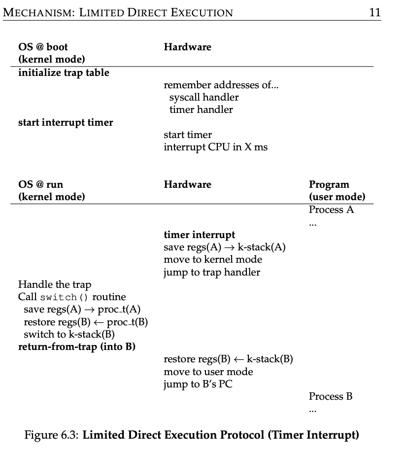
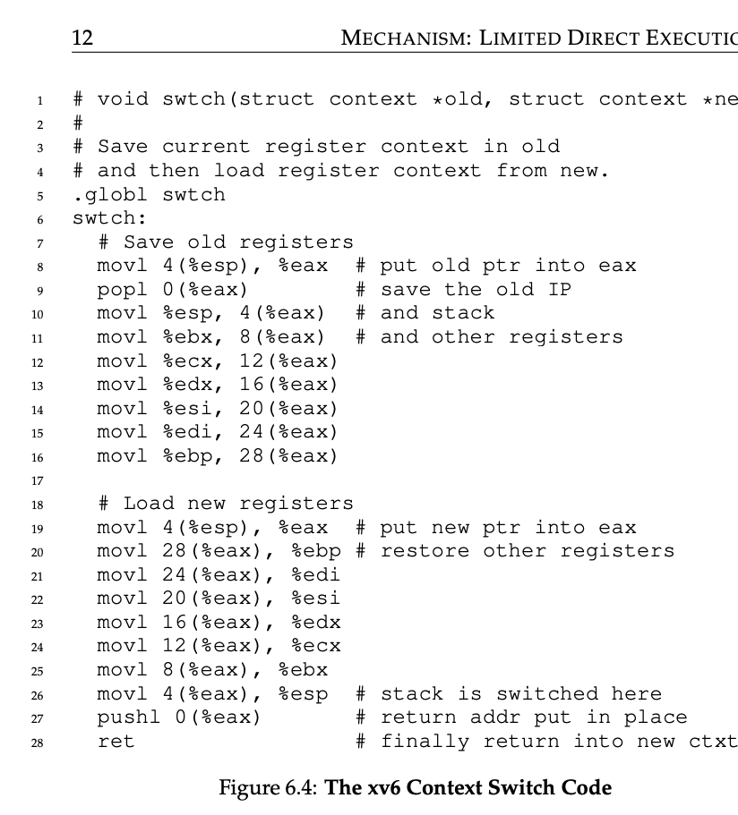

### Key Notes on Saving and Restoring Context

#### **Context Switching Overview**

- **Purpose**: Enables the operating system (OS) to switch between processes, ensuring multitasking and efficient CPU utilization.
- **Trigger**: Can occur cooperatively (via system calls) or forcefully (via timer interrupts).
- **Key Decision**: The scheduler decides whether to continue running the current process or switch to another.

#### **Steps in a Context Switch**

1. **Save Current Process State**:
    - Save general-purpose registers, program counter (PC), and kernel stack pointer of the currently-running process.
    - Use low-level assembly code to perform this operation.
2. **Restore Next Process State**:
    - Restore the saved registers, PC, and kernel stack pointer of the next process to be executed.
    - Switch to the kernel stack of the next process.
3. **Return to User Mode**:
    - Execute a `return-from-trap` instruction to resume execution of the next process.

#### **Timer Interrupts**

- **Importance**: Ensures the OS regains control of the CPU, even if processes are non-cooperative.
- **Mechanism**: Hardware triggers a timer interrupt, saving the current process's state and allowing the OS to decide the next action.

#### **Reboot as a Robust Tool**

- **Use Cases**:
    - Resolves infinite loops or unresponsive processes under cooperative preemption.
    - Reclaims leaked or stale resources (e.g., memory).
    - Resets software to a known, tested state.
- **Automation**: Common in large-scale systems to periodically reboot machines for stability and reliability.

#### **Context Switch Timeline**

1. **Process A Running**: Process A is executing.
2. **Timer Interrupt**: Hardware saves Process A's registers onto its kernel stack and switches to kernel mode.
3. **OS Scheduler Decision**: OS decides to switch to Process B.
4. **Switch Routine**:
    - Saves Process A's state into its process structure.
    - Restores Process B's state from its process structure.
    - Switches to Process B's kernel stack.
5. **Return to User Mode**: OS executes `return-from-trap`, resuming Process B's execution.

#### **Register Save/Restore Types**

1. **Implicit Save (Hardware)**:
    - Occurs during the timer interrupt.
    - Saves user registers of the running process onto its kernel stack.
2. **Explicit Save (Software)**:
    - Performed by the OS during the process switch.
    - Saves kernel registers into the process structure of the interrupted process.

#### **Benefits of Context Switching**

- Enables multitasking by sharing CPU time among processes.
- Ensures system responsiveness and fairness.
- Facilitates recovery from process failures or unresponsiveness.

#### **Key Tips**

- **Timer Interrupts**: Essential for maintaining OS control over the CPU.
- **Rebooting**: A practical and effective method for improving system behavior and reclaiming resources.

