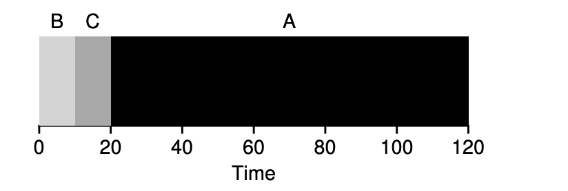
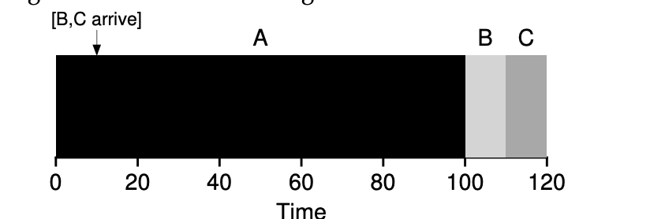

### Key Notes on Shortest Job First (SJF)

#### Overview of SJF

- **Definition**: Shortest Job First (SJF) is a scheduling policy that prioritizes the shortest job first, followed by the next shortest, and so on.
- **Origin**: Borrowed from operations research and applied to computer systems scheduling.
- **Goal**: Minimize average turnaround time by running shorter jobs before longer ones.

#### Example of SJF

- **Scenario**: Jobs A, B, and C with different runtimes.
    - Without SJF: Average turnaround time = 110 seconds.
    - With SJF: Average turnaround time = 50 seconds (a significant improvement).
    - Formula: Average turnaround time = (Completion time of all jobs) ÷ (Number of jobs).

#### Preemptive vs. Non-Preemptive Schedulers

- **Non-Preemptive**: Older systems ran each job to completion before starting a new one.
- **Preemptive**: Modern systems can interrupt a running job to switch to another, enabling more flexibility and efficiency.

#### Optimality of SJF

- **Optimality**: SJF is provably optimal under the assumption that all jobs arrive at the same time.
- **Limitation**: Assumes all jobs are known in advance and arrive simultaneously, which is often unrealistic in real-world scenarios.

#### Challenges with SJF

1. **Late Arrivals**:
    - If jobs arrive at different times, SJF may lead to a **convoy problem**, where shorter jobs arriving later are forced to wait for a longer job to complete.
    - Example:
        - Job A arrives at t=0 and runs for 100 seconds.
        - Jobs B and C arrive at t=10 and each need 10 seconds.
        - Result: B and C wait for A to finish, leading to higher average turnaround time (103.33 seconds).

2. **Dynamic Job Arrival**:
    - SJF struggles when jobs arrive dynamically, as it cannot preempt a long-running job to accommodate shorter ones.

#### Key Takeaways

- **Strengths**: SJF minimizes average turnaround time when all jobs are known and arrive simultaneously.
- **Weaknesses**: Struggles with dynamic arrivals and may cause delays for shorter jobs arriving after a long-running job has started.
- **Modern Adaptations**: Preemptive scheduling can address some of SJF’s limitations by allowing context switches to prioritize shorter jobs dynamically.