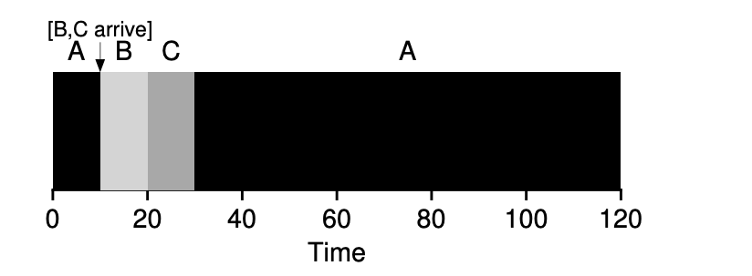

### Key Notes on Shortest Time-to-Completion First (STCF)

#### Overview of STCF

- **Definition**: Shortest Time-to-Completion First (STCF), also known as Preemptive Shortest Job First (PSJF), is a scheduling policy that preempts running jobs to prioritize the job with the least remaining time to completion.
- **Key Difference from SJF**: Unlike SJF, STCF allows preemption, enabling the scheduler to switch between jobs dynamically.

#### How STCF Works

1. **Preemption**:
    - When a new job arrives, the scheduler evaluates all jobs (including the new one) and selects the job with the shortest remaining time to completion.
    - If the new job has a shorter remaining time than the currently running job, the scheduler preempts the current job and runs the new one.
2. **Example**:
    - Job A starts at t=0 and needs 100 seconds.
    - Jobs B and C arrive at t=10 and each need 10 seconds.
    - STCF preempts A at t=10, runs B and C to completion, and then resumes A.
    - **Result**: Average turnaround time = 50 seconds.

#### Benefits of STCF

- **Improved Turnaround Time**:
    - By preempting longer jobs to run shorter ones, STCF significantly reduces average turnaround time compared to non-preemptive SJF.
    - Example: In the scenario above, STCF achieves an average turnaround time of 50 seconds compared to 103.33 seconds with non-preemptive SJF.
- **Optimality**:
    - STCF is provably optimal for minimizing average turnaround time, even when jobs arrive dynamically.

#### Challenges of STCF

1. **Overhead**:
    - Frequent preemptions require context switching, which can introduce overhead and reduce system efficiency.
2. **Complexity**:
    - Requires the scheduler to continuously evaluate remaining times for all jobs, which adds computational complexity.

#### Key Takeaways

- **Strengths**:
    - Addresses the convoy problem seen in SJF by dynamically prioritizing shorter jobs.
    - Optimal for minimizing average turnaround time in systems with dynamic job arrivals.
- **Weaknesses**:
    - Higher overhead due to frequent context switching.
    - Increased complexity in implementation compared to non-preemptive schedulers.
- **Use Case**:
    - Ideal for systems where minimizing turnaround time is critical and job arrival times are unpredictable.