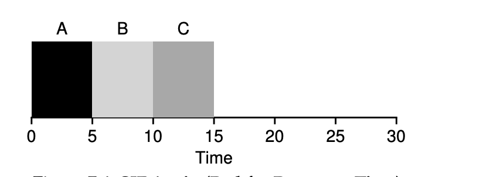

### Key Notes on Response Time

1. **Definition of Response Time**:
    
    - Response time is the time from when a job arrives in the system to the first time it is scheduled.
    - Formula:  
        **Tresponse = Tfirst_run − Tarrival**
    - Some definitions include the time until the job produces a response, but the discussed definition assumes an instantaneous response.
2. **Historical Context**:
    
    - Early batch computing systems prioritized turnaround time, making algorithms like Shortest Time-to-Completion First (STCF) effective.
    - The advent of time-shared machines introduced the need for interactive performance, leading to the emergence of response time as a critical metric.
3. **Challenges with STCF for Response Time**:
    
    - While STCF is excellent for minimizing turnaround time, it performs poorly for response time.
    - Example: If three jobs arrive simultaneously, the third job must wait for the first two to complete before being scheduled, leading to poor interactivity.
4. **Illustrative Example**:
    
    - In a schedule where:
        - Job A arrives at time 0, and jobs B and C arrive at time 10.
        - Response times:
            - Job A: 0
            - Job B: 0
            - Job C: 10
        - Average response time: **3.33**.
    - This demonstrates how STCF can delay response times for later jobs.

1. **Importance of Response Time in Interactivity**:
    
    - Poor response time can lead to frustrating user experiences, e.g., waiting 10 seconds for a system to respond to a typed command.
2. **Round Robin Scheduling**:
    
    - Round Robin scheduling is better suited for response time as it ensures jobs are scheduled in a time-shared manner, improving interactivity.
3. **Problem Statement**:
    
    - The challenge is to design a scheduler that balances turnaround time and response time, ensuring sensitivity to interactivity needs.