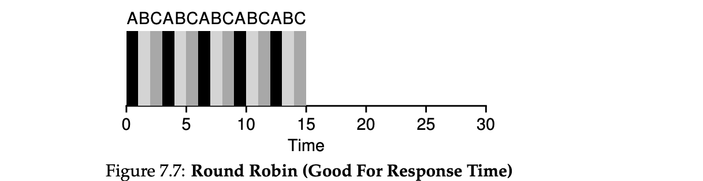

### Key Notes on Round Robin (RR) Scheduling

1. **Definition of Round Robin (RR)**:
    
    - RR is a scheduling algorithm where jobs are run for a fixed time slice (or scheduling quantum) before switching to the next job in the queue.
    - This process repeats until all jobs are completed, making RR a **time-slicing** algorithm.
2. **Time Slice**:
    
    - The time slice must be a multiple of the timer-interrupt period (e.g., 10 ms, 20 ms, etc.).
    - The length of the time slice is critical:
        - **Shorter time slices** improve response time but increase context-switching overhead.
        - **Longer time slices** reduce context-switching costs but may harm responsiveness.
3. **Amortization of Context-Switching Costs**:
    
    - Context switching incurs overhead (e.g., saving/restoring registers, flushing CPU caches, TLBs, etc.).
    - To reduce this cost, the time slice should be long enough to amortize the overhead but not so long that responsiveness suffers.
4. **Example Comparison**:
    
    - Three jobs (A, B, C) arrive simultaneously, each requiring 5 seconds to complete:
        - **SJF**: Runs each job to completion sequentially.
            - Average response time: **5** (0 + 5 + 10) ÷ 3.
            - Average turnaround time: **10** (5 + 10 + 15) ÷ 3.
        - **RR (1-second time slice)**: Cycles through jobs in 1-second intervals.
            - Average response time: **1** (0 + 1 + 2) ÷ 3.
            - Average turnaround time: **14** (13 + 14 + 15) ÷ 3.
5. **Performance Trade-offs**:
    
    - **Response Time**:
        - RR excels at minimizing response time, making it ideal for interactive systems.
    - **Turnaround Time**:
        - RR performs poorly for turnaround time because it stretches out job completion by switching frequently.
        - It is often worse than FIFO for this metric.
6. **Fairness vs. Performance**:
    
    - RR is inherently **fair**, dividing CPU time evenly among processes.
    - However, fairness comes at the cost of turnaround time.
    - Trade-off:
        - **Fairness and low response time** → Poor turnaround time.
        - **Optimizing turnaround time** → Requires unfairness (e.g., prioritizing shorter jobs).
7. **Scheduler Types**:
    
    - **SJF/STCF**: Optimizes turnaround time but is bad for response time.
    - **RR**: Optimizes response time but is bad for turnaround time.
8. **General System Design Insight**:
    
    - Trade-offs are inherent in scheduling:
        - You cannot optimize all metrics simultaneously (e.g., response time vs. turnaround time).
    - Overlap operations (e.g., disk I/O, remote messaging) to maximize system utilization and efficiency.
9. **Future Considerations**:
    
    - RR assumes jobs do no I/O and that job runtimes are known. These assumptions will need to be addressed for more realistic scheduling scenarios.

