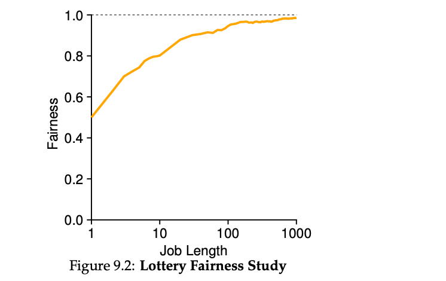

#### Lottery Scheduling Dynamics:

1. **Scenario Setup**:
    
    - Two jobs compete with equal tickets (100 each) and equal run time (R, which varies).
    - Goal: Both jobs should finish at roughly the same time.
2. **Fairness Metric (F)**:
    
    - **Definition**: F = (Time first job completes) ÷ (Time second job completes).
    - Example: If R = 10, first job finishes at 10, second job at 20 → F = 10 ÷ 20 = 0.5.
    - **Ideal Fairness**: F = 1 (both jobs finish at the same time).
3. **Fairness Behavior**:
    
    - **Short Job Lengths (Low R)**:
        - Fairness (F) is low due to the randomness of lottery scheduling.
    - **Longer Job Lengths (High R)**:
        - Fairness improves as jobs run for more time slices.
        - Lottery scheduling approaches the desired fair outcome (F ≈ 1).
4. **Graphical Observation**:
    
    - Fairness (F) increases as job length (R) grows from 1 to 1000.
    - Results are based on 30 trials using a simulator.

### Key Notes on "How To Assign Tickets?"

- **Problem Overview**: The challenge lies in determining how to allocate tickets to jobs in a lottery scheduling system, as the system's behavior heavily depends on ticket distribution.
    
- **User-Driven Allocation**:
    
    - Users are given a set number of tickets.
    - Users can allocate tickets to their jobs as they see fit.
    - **Limitation**: This approach is a "non-solution" as it does not provide a clear strategy or guidance for ticket assignment.
- **Open Problem**: The "ticket-assignment problem" remains unresolved, with no definitive method for optimal ticket allocation among jobs.