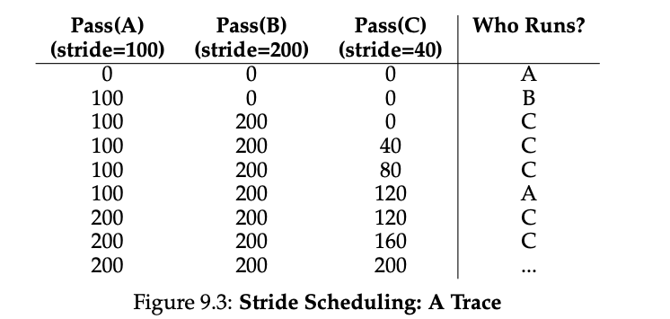

### Key Notes on "Stride Scheduling"

- **Why Avoid Randomness?**
    - Randomness in lottery scheduling is simple and approximately correct but may not deliver exact proportions over short time scales.
    - Stride scheduling was invented by Waldspurger as a **deterministic fair-share scheduler** to address this issue.

---

- **How Stride Scheduling Works**:
    1. **Stride Calculation**:
        
        - Each job is assigned a **stride**, which is inversely proportional to the number of tickets it holds.
        - Example: If tickets for jobs A, B, and C are 100, 50, and 250, their strides are calculated as:
            - A: `10,000 / 100 = 100`
            - B: `10,000 / 50 = 200`
            - C: `10,000 / 250 = 40`
    2. **Pass Value**:
        
        - Each job has a **pass value** initialized to 0.
        - When a job runs, its pass value is incremented by its stride to track its progress.
    3. **Scheduling Logic**:
        
        - The scheduler picks the job with the **lowest pass value** to run next.
        - After running, the job's pass value is updated by adding its stride.
    4. **Example Execution**:
        
        - Initial pass values: A = 0, B = 0, C = 0.
        - Execution order:
            - A runs → Pass = 100
            - B runs → Pass = 200
            - C runs → Pass = 40
            - C runs again → Pass = 80
            - C runs again → Pass = 120
            - A runs → Pass = 200
            - C runs twice → Pass = 160, then 200.
        - Result: Jobs run in exact proportion to their ticket values (e.g., C runs 5 times, A twice, B once).

---

- **Advantages of Stride Scheduling**:
    - **Precision**: Achieves exact proportions at the end of each scheduling cycle.
    - Deterministic behavior ensures fairness.

---

- **Comparison with Lottery Scheduling**:
    - **Lottery Scheduling**:
        
        - Achieves proportions probabilistically over time.
        - Easier to incorporate new processes (no global state per process).
        - Example: A new job can be added without disrupting the system.
    - **Stride Scheduling**:
        
        - Requires maintaining **global state** (e.g., pass values).
        - Adding a new job mid-cycle can cause issues (e.g., monopolization if pass value is set to 0).