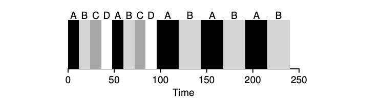

#### Overview

- **CFS Goal**: Achieves fair-share scheduling by dividing CPU time evenly among competing processes in an efficient and scalable manner.
- **Efficiency Importance**: Scheduler efficiency is critical, as scheduling can consume up to 5% of datacenter CPU time (e.g., Google datacenters).

#### Basic Operation

- **Virtual Runtime (vruntime)**:
    - Each process accumulates `vruntime` as it runs.
    - Scheduler picks the process with the **lowest vruntime** to run next.
- **Fairness vs. Performance**:
    - Frequent switching increases fairness but incurs high context-switching overhead.
    - Less frequent switching improves performance but reduces near-term fairness.

#### Key Parameters

1. **`sched_latency`**:
    
    - Determines how long a process runs before switching.
    - Divided by the number of processes (`n`) to calculate each process's time slice.
    - Example: If `sched_latency = 48ms` and `n = 4`, each process gets a time slice of `12ms`.
2. **`min_granularity`**:
    
    - Ensures a minimum time slice to avoid excessive context switching.
    - Example: If `sched_latency / n` results in a time slice < `min_granularity` (e.g., 6ms), the time slice is set to `min_granularity`.

#### Handling Many Processes

- When too many processes are running, `min_granularity` prevents time slices from becoming too small, maintaining CPU efficiency at the cost of slight fairness deviation.

#### Scheduling Mechanism

- **Periodic Timer Interrupt**:
    - Occurs at fixed intervals (e.g., every 1ms).
    - Allows CFS to check if the current process has completed its time slice.
- **Precision Tracking**:
    - CFS tracks `vruntime` precisely, ensuring long-term fairness even if time slices are not perfect multiples of the timer interval.

#### Example Scenario

- **4 Processes (A, B, C, D)**:
    - Each process runs for its calculated time slice (e.g., 12ms).
    - Once two processes (C, D) complete, the remaining two (A, B) run in a round-robin fashion with adjusted time slices.

#### Summary of Benefits

- **Fairness**: Ensures even CPU sharing over time.
- **Efficiency**: Limits scheduling overhead with parameters like `min_granularity`.
- **Scalability**: Handles varying numbers of processes dynamically.



---

### Key Notes on CFS (Completely Fair Scheduler) and Niceness:

#### **Niceness and Priority:**

- **Nice Levels:**
    - Range: `-20` (highest priority) to `+19` (lowest priority).
    - Default value: `0`.
    - Lower nice values = Higher priority, and vice versa.
- **Impact of Niceness:**
    - Processes with lower nice values get more CPU time.
    - Being "too nice" (higher nice values) results in less CPU scheduling attention.

#### **Weights Mapping:**
```c
static const int prio_to_weight[40] = {
/* -20 */ 88761, 71755, 56483, 46273, 36291,
/* -15 */ 29154, 23254, 18705, 14949, 11916,
/* -10 */ 9548, 7620, 6100, 4904, 3906,
/* -5 */ 3121, 2501, 1991, 1586, 1277,
/* 0 */ 1024, 820, 655, 526, 423,
/* 5 */ 335, 272, 215, 172, 137,
/* 10 */ 110, 87, 70, 56, 45,
/* 15 */ 36, 29, 23, 18, 15,
};
```
- Each nice value is mapped to a specific weight:
    - Example weights:
        - Nice `-20`: `88761`
        - Nice `0`: `1024`
        - Nice `+19`: `15`
    - Full weight table provided in the text.

#### **Time Slice Calculation:**

- Formula:  
    `time slice_k = (weight_k / Σ(weight_i)) * sched_latency`
    - `weight_k`: Weight of process `k`.
    - `Σ(weight_i)`: Sum of weights of all processes.
    - `sched_latency`: Total scheduling latency.
- Example:
    - Two jobs: A (nice `-5`, weight `3121`) and B (nice `0`, weight `1024`).
    - time_slice_A = `3121/(3121+1024) * 48 = 36.14185765983112`
    - time_slice_B = `1024/(3121+1024) * 48 = 11.858142340168879`****
    - A gets **3/4 of sched_latency** (e.g., 36ms), and B gets **1/4 of sched_latency** (e.g., 12ms).

#### **Vruntime Calculation:**

- Formula:  
    `vruntime_i = vruntime_i + (weight0 / weight_i) * runtime_i`
    - `weight0`: Default weight (`1024`).
    - `vruntime_i`: The current virtual runtime of process `i`.
    - `weight_i`: Weight of process `i`.
    - `runtime_i`: Actual runtime of process `i`.
- Processes with higher weights (lower nice values) accumulate `vruntime` more slowly, giving them more CPU time.

#### **Proportionality of CPU Allocation:**

- The weight table ensures **CPU proportionality ratios remain constant** for equal differences in nice values.
    - Example: If A has nice `5` and B has nice `10`, their scheduling behavior will be proportional to the same ratio as nice `-5` and `0`.

#### **Key Takeaways:**

- **Niceness affects scheduling priority** by mapping to weights.
- **Weights determine time slices** and how much CPU time a process gets.
- **Vruntime adjusts dynamically** based on process weight, ensuring fairness.
- The weight table is designed to maintain proportional CPU allocation for consistent nice value differences.

### Example
To calculate the **vruntime** for process A using the new formula, we need to apply the given formula:

### Formula:

**vruntime_i = vruntime_i + (weight0 / weight_i) * runtime_i**

Where:

- `vruntime_i`: The current virtual runtime of process `i`.
- `weight0`: Default weight (1024).
- `weight_i`: Weight of process `i` (from the weight table based on its nice value).
- `runtime_i`: Actual runtime of process `i`.

---

### Given Data for Process A:

- **Nice value of A**: `-5`
- **Weight of A (weight_i)**: `3121` (from the weight table for nice `-5`).
- **Default weight (weight0)**: `1024`
- **Runtime of A (runtime_i)**: Not explicitly given, so let’s assume `runtime_i = 1 ms` for simplicity.

---

### Calculation:

Using the formula: **vruntime_A = vruntime_A + (weight0 / weight_A) * runtime_A**

Substitute the values: **vruntime_A = vruntime_A + (1024 / 3121) * 1**

Simplify: **vruntime_A = vruntime_A + 0.328 ms**

---

### Result:

- For every `1 ms` of actual runtime, process A's **vruntime** will increase by approximately **0.328 ms**.
- This means process A's **vruntime** accumulates **slower** than processes with lower weights (higher nice values), giving it more CPU time.
- This means the process A can run more times than process B whose vruntime increases quicker.s

If you have a specific `runtime_A` value, you can substitute it into the formula to compute the exact **vruntime**.