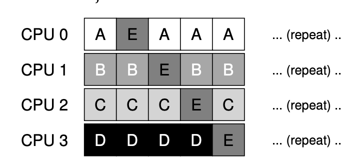

#### 1. **Single-Queue Multiprocessor Scheduling (SQMS)**:

- **Definition**:
    - SQMS involves placing all jobs that need to be scheduled into a single queue.
    - The scheduler selects jobs from this single queue to run on multiple CPUs.
- **Advantages**:
    - **Simplicity**: Easy to adapt single-CPU scheduling policies to multiprocessor systems.
    - Minimal changes are required to extend existing single-CPU schedulers.

#### 2. **Shortcomings of SQMS**:

- **Scalability Issues**:
    - Locks are used to ensure correctness when accessing the single queue.
    - As the number of CPUs increases, contention for the lock grows, leading to:
        - Increased lock overhead.
        - Reduced system performance as more time is spent managing locks rather than executing jobs.
- **Cache Affinity Problems**:
    - Jobs frequently switch between CPUs, which disrupts cache affinity.
    - Example:
        - Assume 5 jobs (A, B, C, D, E) and 4 CPUs.
        - Jobs are scheduled as follows:
            
            ```
            CPU 1: A → E → B
            CPU 2: B → A → C
            CPU 3: C → D → D
            CPU 4: D → C → E
            ```
            
        - Jobs bounce between CPUs, requiring cache state to be reloaded each time, which degrades performance.

#### 3. **Affinity Mechanisms in SQMS**:

- **Purpose**:
    - To improve performance by keeping jobs on the same CPU whenever possible, preserving cache affinity.
- **Example**:
    - Jobs A through D remain on the same CPUs, while job E migrates:
    
        
        ```
        CPU 1: A → A → A
        CPU 2: B → B → B
        CPU 3: C → C → C
        CPU 4: D → E → D
        ```
        
    - This approach balances load while maintaining cache affinity for most jobs.
- **Challenges**:
    - Implementing affinity mechanisms can be complex.
    - Balancing load and preserving cache affinity simultaneously requires careful design.

#### 4. **Strengths and Weaknesses of SQMS**:

- **Strengths**:
    - Straightforward to implement using existing single-CPU schedulers.
- **Weaknesses**:
    - Poor scalability due to synchronization overheads (lock contention).
    - Does not inherently preserve cache affinity, leading to performance degradation.