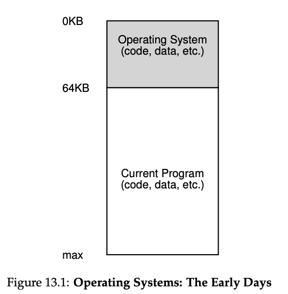
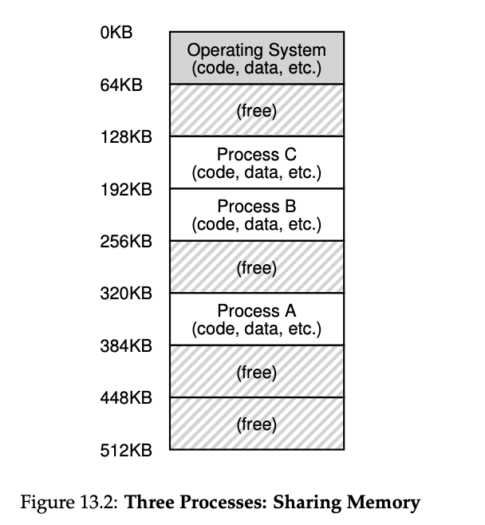

#### . **Early Systems**

- **Simple Memory Model**: Physical memory was directly exposed to users.
    - OS was a simple library sitting in memory (e.g., starting at address 0).
    - Only one program (process) ran at a time, starting at a specific memory location (e.g., 64k).
- **No Abstraction**: Users had minimal expectations from the OS.
- **Ease for Developers**: OS development was straightforward due to the simplicity of user demands.

#### 2. **Multiprogramming**

- **Need for Efficiency**: Machines were expensive, so sharing them became essential.
- **Multiple Processes**: Multiple processes could be ready to run, and the OS would switch between them (e.g., during I/O operations).
- **Increased CPU Utilization**: Allowed better use of costly machines, which were worth hundreds of thousands or millions of dollars.

#### 3. **Time Sharing**

- **Demand for Interactivity**: Batch computing was inefficient for programmers due to long debugging cycles.
- **Interactive Use**: Enabled multiple users to interact with the machine concurrently, expecting timely responses.
- **Implementation Challenge**:
    - Early approach: Save the entire memory state of one process to disk and load another process’s state.
    - **Problem**: Saving/restoring full memory to disk was too slow, especially as memory size increased.
_
#### 4. **Efficient Time Sharing**

- **In-Memory Processes**: Processes were left in memory while switching between them, avoiding the need to save/restore full memory to disk.
- **Example Setup**:
    - Physical memory divided among processes (e.g., A, B, C).
    - OS runs one process (e.g., A) while others (e.g., B, C) wait in the ready queue.
- **Protection Becomes Critical**:
    - Multiple programs in memory raised the need for protection.
    - Processes must not read or write each other’s memory.