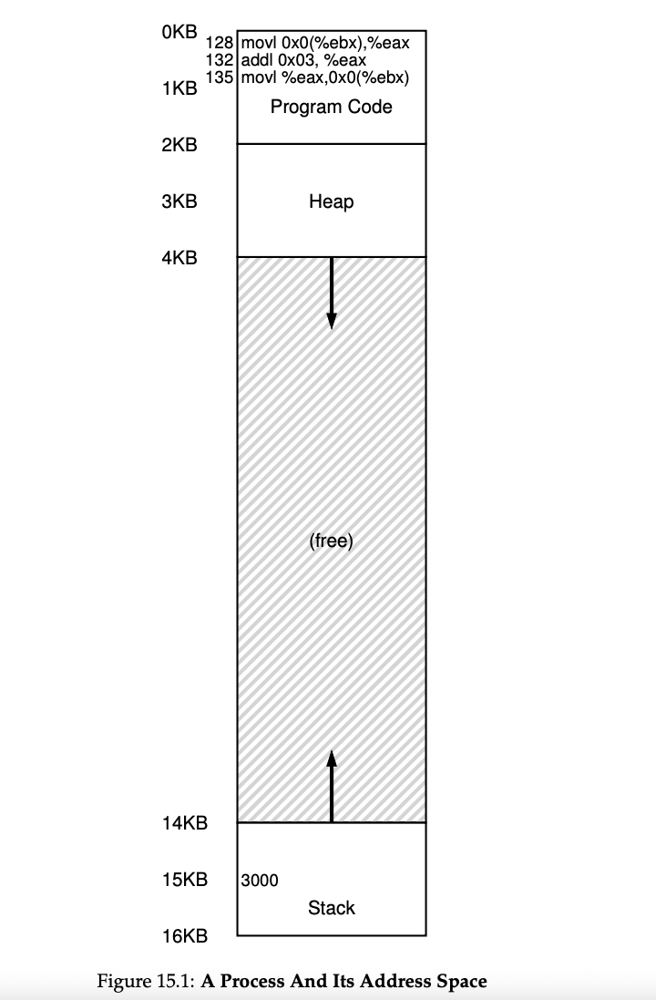

### Comprehensive Explanation of the Code Execution and Memory Access

#### **Code Overview**

The provided code snippet demonstrates how a simple operation (`x = x + 3`) is translated into assembly instructions and executed by the CPU. Here's the breakdown:

```c
void func() {
    int x = 3000; // Variable initialization
    x = x + 3;    // Line of interest
}
```

#### **Assembly Translation**

The compiler translates the line `x = x + 3` into the following x86 assembly instructions:

|Address|Assembly Instruction|Explanation|
|---|---|---|
|`128`|`movl 0x0(%ebx), %eax`|Load the value at the memory address stored in `ebx` (address of `x`) into the `eax` register.|
|`132`|`addl $0x03, %eax`|Add the immediate value `3` to the value in the `eax` register.|
|`135`|`movl %eax, 0x0(%ebx)`|Store the updated value in `eax` back into the memory location pointed to by `ebx`.|

#### **Memory Layout**

In the process's address space, the memory is organized as follows:

- **Code Section**: Contains the instructions of the program, including the three-instruction sequence starting at address `128`.
- **Stack Section**: Contains the variable `x`, located at address `15 KB` (15,360 bytes from the base of the stack).

#### **Execution Steps**

When the program runs, the following sequence of memory accesses occurs:

1. **Instruction Fetch**:
    
    - The CPU fetches the instruction at address `128` from the **code section**.
    - This instruction (`movl 0x0(%ebx), %eax`) is executed, loading the value of `x` (3000) from the **stack** (address `15 KB`) into the `eax` register.
2. **Instruction Fetch**:
    
    - The CPU fetches the instruction at address `132` from the **code section**.
    - This instruction (`addl $0x03, %eax`) is executed, adding `3` to the value in the `eax` register. No memory access occurs here, as the operation is performed entirely within the CPU registers.
3. **Instruction Fetch**:
    
    - The CPU fetches the instruction at address `135` from the **code section**.
    - This instruction (`movl %eax, 0x0(%ebx)`) is executed, storing the updated value (`3003`) from the `eax` register back into the **stack** at address `15 KB`.

#### **Memory Access Summary**

From the perspective of the process, the following memory accesses occur during execution:

|Step|Memory Access Type|Address|Description|
|---|---|---|---|
|1|Instruction Fetch|`128`|Fetch the first instruction from the **code section**.|
|2|Data Load|`15 KB`|Load the value of `x` (3000) from the **stack** into the `eax` register.|
|3|Instruction Fetch|`132`|Fetch the second instruction from the **code section**.|
|4|Register Operation|N/A|Add `3` to the value in the `eax` register (no memory access).|
|5|Instruction Fetch|`135`|Fetch the third instruction from the **code section**.|
|6|Data Store|`15 KB`|Store the updated value (`3003`) from the `eax` register back into the **stack**.|

#### **Key Concepts Illustrated**

1. **Instruction Fetch**:
    
    - Instructions are fetched from the **code section** of the process's address space.
    - Each instruction is executed sequentially.
2. **Data Access**:
    
    - Data is loaded from and stored to the **stack** section of the process's address space.
    - The CPU uses registers (`eax`, `ebx`) to perform intermediate computations.
3. **Register Usage**:
    
    - Registers (`eax`, `ebx`) are used for temporary storage and computation, minimizing direct memory access for efficiency.
4. **Memory Virtualization**:
    
    - The process perceives its own private address space, with the **code section** and **stack** logically separated.
    - The OS and hardware work together to map these virtual addresses to physical memory locations.




---

![[Chapter-15-2.png]]

### Comprehensive Answer: Virtualizing Memory and Relocating Processes

#### **Problem: Relocating a Process in Physical Memory**

- **Process Perspective**:
    - From the process's point of view, its **virtual address space** starts at address `0` and grows up to a maximum of `16 KB`.
    - All memory references generated by the process are within this virtual address range (`0` to `16 KB`).
- **OS Perspective**:
    - The OS does not place the process at virtual address `0` in **physical memory**.
    - Instead, the OS relocates the process to a different physical memory location, such as starting at `32 KB`, while maintaining the **illusion** that the process's address space starts at `0`.

#### **Key Challenge**

- **Transparency**: How can the OS relocate the process in physical memory without the process being aware of it?
- **Illusion**: How can the OS provide the process with the illusion of a virtual address space starting at `0`, even though it is physically located elsewhere?

---

#### **Solution: Address Translation**

The OS and hardware work together to solve this problem using **address translation**, which maps **virtual addresses** (used by the process) to **physical addresses** (used by the hardware). Here's how it works:

1. **Virtual Address Space**:
    
    - The process generates memory references (e.g., for code, data, stack) using **virtual addresses** in its own private address space.
    - These addresses range from `0` to `16 KB`.
2. **Physical Address Space**:
    
    - The OS places the process in a specific region of physical memory, such as starting at `32 KB`.
    - The physical memory layout might look like this:
        - **0 KB - 16 KB**: Reserved for the OS.
        - **16 KB - 32 KB**: Free.
        - **32 KB - 48 KB**: Process's relocated address space.
        - **48 KB - 64 KB**: Free.
3. **Address Translation Mechanism**:
    
    - The hardware (with OS setup) translates each **virtual address** generated by the process into a corresponding **physical address**.
    - For example:
        - Virtual address `0` maps to physical address `32 KB`.
        - Virtual address `4 KB` maps to physical address `36 KB`.
        - Virtual address `16 KB` maps to physical address `48 KB`.
4. **Transparency**:
    
    - The process is unaware of this translation.
    - It continues to operate as if its address space starts at `0`, while the OS and hardware handle the actual physical memory mapping.

---

#### **Example: Physical Memory Layout**

Here’s an example of how physical memory might look after relocating the process:

|Physical Address Range|Usage|
|---|---|
|`0 KB - 16 KB`|Operating System (OS)|
|`16 KB - 32 KB`|Free|
|`32 KB - 48 KB`|Process's Address Space|
|`48 KB - 64 KB`|Free|

---

#### **Benefits of Address Translation**

1. **Transparency**:
    - The process perceives its own private address space starting at `0`, regardless of its actual physical location.
2. **Flexibility**:
    - The OS can place the process anywhere in physical memory, optimizing memory usage and avoiding conflicts.
3. **Protection**:
    - The OS ensures that processes cannot access each other’s memory or the OS memory, maintaining isolation and security.

---

#### **Key Takeaways**

- **Virtual Address Space**: The process operates within a virtual address range (`0` to `16 KB`), unaware of its physical location.
- **Physical Address Space**: The OS relocates the process to a specific physical memory region (e.g., starting at `32 KB`).
- **Address Translation**: The hardware translates virtual addresses to physical addresses, ensuring transparency and maintaining the illusion of a private address space.
- **Memory Layout**: Physical memory is divided into regions for the OS, processes, and free space, with the OS managing allocations and relocations.

This approach enables efficient memory virtualization, providing processes with the illusion of private memory while allowing the OS to manage physical memory flexibly and securely.