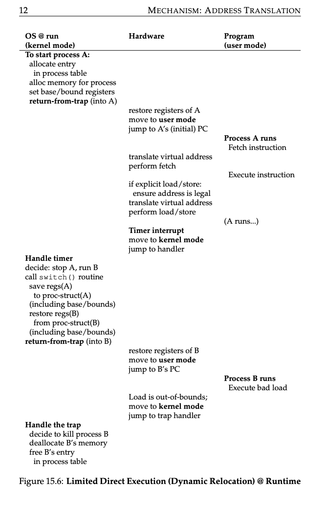

### Key Notes on Address Translation and Dynamic Relocation (Summary)

1. **Address Translation Overview**:
    - A mechanism in virtual memory where the OS **controls every memory access** from a process.
    - Translates **virtual addresses** (process's view of memory) into **physical addresses** (actual memory location).
    - Performed transparently, so the process is unaware of the translation, creating the **illusion of direct memory access**.

---

2. **Base-and-Bounds Virtualization**:
    - A simple and efficient form of virtualization using **base and bounds registers**:
        - **Base Register**: Adds a base value to the virtual address for translation.
        - **Bounds Register**: Ensures the address is within the allocated memory range.
    - **Efficiency**:
        - Requires minimal hardware logic for translation and bounds checking.
    - **Protection**:
        - Prevents processes from accessing memory outside their allocated space.
        - Ensures system stability by protecting critical OS structures (e.g., trap table).

---

3. **Limitations of Dynamic Relocation**:
    - **Internal Fragmentation**:
        - Wasted memory within allocated slots due to unused space (e.g., between stack and heap).
        - Example: A process using memory from 32 KB to 48 KB may leave unused space between the stack and heap.
    - **Fixed-Sized Slots**:
        - Restricts memory allocation to fixed-sized slots, leading to inefficient memory utilization.
        - Even with sufficient physical memory, fragmentation can limit the number of processes.

---

4. **Need for Advanced Techniques**:
    - To address inefficiencies like internal fragmentation, more sophisticated memory management techniques are required.
    - **Segmentation**:
        - A generalization of base-and-bounds virtualization, introduced as the next step to improve memory utilization.

---

5. **Key Takeaways**:
    - Address translation ensures **process isolation**, **memory protection**, and **efficient memory virtualization**.
    - Base-and-bounds is a foundational technique, combining simplicity and protection, but suffers from **fragmentation inefficiencies**.
    - The OS and hardware must evolve to more advanced mechanisms (e.g., segmentation) to better manage physical memory and reduce waste.