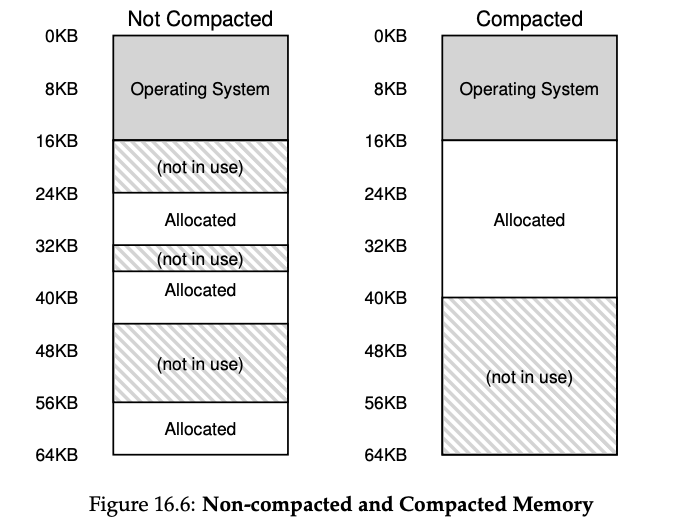

### Key Notes on "Fine-grained vs. Coarse-grained Segmentation"

1. **Coarse-grained Segmentation**:
    
    - Address space is divided into **large, coarse chunks** (e.g., code, stack, heap).
    - Common in many systems, as seen in previous examples.
2. **Fine-grained Segmentation**:
    
    - Address space is divided into **many smaller segments**.
    - Provides greater flexibility in managing memory.
    - Example: Systems like **Multics** and **Burroughs B5000** supported thousands of segments.
3. **Hardware Support for Fine-grained Segmentation**:
    
    - Requires a **segment table** stored in memory to manage a large number of segments.
    - Segment tables enable the creation and management of numerous segments.
4. **Advantages of Fine-grained Segmentation**:
    
    - **Flexibility**: Allows the OS to manage memory more effectively.
    - **Efficient Memory Utilization**:
        - The OS can track which segments are in use and which are not.
        - Helps optimize the use of main memory.
5. **Historical Context**:
    
    - Early systems like the **Burroughs B5000** relied on fine-grained segmentation.
    - Compilers were designed to divide code and data into separate segments for better management by the OS and hardware.
6. **Trade-offs**:
    
    - Fine-grained segmentation requires **additional hardware complexity** (e.g., segment tables).
    - Coarse-grained segmentation is simpler but less flexible in memory management.
