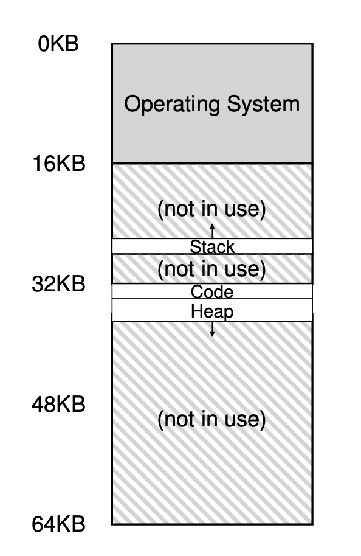

### Key Notes on Segmentation: Generalized Base/Bounds

1. **Concept of Segmentation**:
    
    - Introduced in the early 1960s to manage memory efficiently.
    - Divides the address space into logical segments (e.g., **code**, **stack**, **heap**).
    - Each segment has its own **base** and **bounds** pair in the MMU (Memory Management Unit).
2. **Purpose**:
    
    - Allows the OS to place each segment in different parts of physical memory.
    - Avoids wasting physical memory on unused virtual address space (supports **sparse address spaces**).
3. **Hardware Support**:
    
    - Requires **base and bounds registers** for each segment.
    - Example: A system with three segments (code, heap, stack) will have three base and bounds register pairs.
4. **Example Configuration**:
    
    - Physical memory: 64KB (16KB reserved for OS).
    - Segment placement:
        
        |Segment|Base Address|Size|
        |---|---|---|
        |Code|32KB|2KB|
        |Heap|34KB|3KB|
        |Stack|28KB|2KB|
	- Since we are now using registers per segment in MMU, we can put it in different place in memory like in figure.

1. **Translation Process**:
    
    - **Code Segment Example**:
        - Virtual address: 100.
        - Physical address: `Base Of Code (32KB) + Offset (100) = 32868`.
        - Bounds check: Valid if offset < segment size (2KB).
    - **Heap Segment Example**:
        - Virtual address: 4200.
        - Offset: `4200 - 4096 (heap start) = 104`. Here, because code segment is 4096 bytes.
        - Physical address: `Base Of Heap (34KB)  + Offset (104) = 34920`.
    - **Illegal Address Example**:
        - Virtual address: 7KB (beyond heap bounds).
        - Hardware detects out-of-bounds access, traps to OS, and likely terminates the process (segmentation fault).
2. **Key Benefits**:
    
    - Efficient use of physical memory by allocating space only for used segments.
    - Simplifies handling of large, sparse virtual address spaces.
3. **Error Handling**:
    
    - Illegal memory access (e.g., accessing beyond segment bounds) triggers a **segmentation fault**.
    - The OS handles the fault by terminating the offending process.
4. **Famous Term**:
    
    - The term **segmentation fault** originates from this mechanism, commonly encountered by C programmers.

## SideNote
The virtual address **4096** is the **starting virtual address of the heap segment**, and it is determined by how the **logical address space** is organized. Here's a comprehensive breakdown of how this value is derived:

---

### 1. **Logical Address Space Layout**

- In a typical process, the **logical address space** is divided into segments such as:
    - **Code segment**: Contains the program's executable instructions.
    - **Heap segment**: Used for dynamically allocated memory (e.g., `malloc` in C).
    - **Stack segment**: Used for function calls, local variables, and return addresses.
- These segments are assigned **virtual address ranges** in a predefined order, based on how the operating system organizes the address space.

---

### 2. **Canonical Address Space Example**

- In the example provided, the logical address space is laid out as follows:
    
    - **Code segment**: Starts at virtual address **0**.
    - **Heap segment**: Starts immediately after the code segment.
    - **Stack segment**: Starts at the top of the address space and grows downward.
- The **starting virtual address of the heap segment** is determined by the size of the code segment. If the code segment is **4KB (4096 bytes)** in size, the heap segment will start at **4096 (4KB)**.
    

---

### 3. **Why Virtual Address 4096?**

- The virtual address **4096** is the **boundary** where the code segment ends and the heap segment begins.
- This is based on the assumption that:
    - The code segment occupies the first **4KB** of the virtual address space (from **0 to 4095**).
    - The heap segment starts immediately after, at **4096**.

---

### 4. **General Rule for Segment Placement**

- The starting virtual address of a segment depends on:
    1. **The size of the preceding segment(s)**.
    2. **The logical layout of the address space** as defined by the operating system.
- In this case:
    - Code segment: Starts at **0**, size is **4KB** → Ends at **4095**.
    - Heap segment: Starts at **4096** (next available virtual address).

---

### 5. **How This Fits into the Example**

- In the example:
    - The heap segment starts at virtual address **4096**.
    - When a virtual address like **4200** is accessed, it is relative to this starting point.
    - To calculate the **offset** within the heap, the starting virtual address of the heap (**4096**) is subtracted from the given virtual address (**4200**).