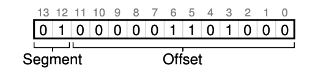

### Key Notes on "16.2 Which Segment Are We Referring To?"

#### **Segment Selection in Address Translation**

1. **Segment Registers**: Hardware uses segment registers to translate virtual addresses into physical addresses.
2. **Explicit Approach**:
    - Virtual address space is divided into segments using the top few bits of the virtual address.
    - Example: VAX/VMS system uses the top two bits of a 14-bit virtual address to determine the segment.
    - Segments in the example:
        - `00`: Code segment
        - `01`: Heap segment
        - `10`: Stack segment
    - Remaining bits represent the offset within the segment.

#### **Translation Example**

1. Virtual address `4200` (binary: `01 000100000000`):
    - Top two bits (`01`) indicate the heap segment.
    - Bottom 12 bits (`000100000000`) are the offset (decimal: 104).

2. Translation process:
    - Hardware uses the segment base and bounds to compute the physical address.
    - Physical Address = Base[Segment] + Offset.
    - Bounds check ensures the offset is within the segment's limits.

#### **Translation Algorithm**

```plaintext
1. Extract top bits to determine the segment:
   Segment = (VirtualAddress & SEG_MASK) >> SEG_SHIFT
2. Extract offset:
   Offset = VirtualAddress & OFFSET_MASK
3. Check bounds:
   If Offset >= Bounds[Segment], raise a protection fault.
4. Compute physical address:
   PhysAddr = Base[Segment] + Offset
5. Access memory:
   Register = AccessMemory(PhysAddr)
```

```c
  // get top 2 bits of 14-bit VA
  Segment = (VirtualAddress & SEG_MASK) >> SEG_SHIFT;
  // now get offset
  Offset = VirtualAddress & OFFSET_MASK;
  if (Offset >= Bounds[Segment])
      RaiseException(PROTECTION_FAULT);
  else
      PhysAddr = Base[Segment] + Offset;
  Register = AccessMemory(PhysAddr);
```
- Example constants:
    - `SEG_MASK = 0x3000`
    - `SEG_SHIFT = 12`
    - `OFFSET_MASK = 0xFFF`

#### **Unused Address Space**

1. Using the top two bits for segment selection leaves one segment unused (e.g., 16KB address space split into 4KB segments).
2. Optimization:
    - Combine code and heap into one segment to use only one bit for segment selection.

#### **Segment Size Limitation**

1. Maximum segment size is limited by the number of bits used for segment selection.
    - Example: 4KB per segment in a 16KB address space with two bits for segment selection.
2. Programs cannot grow segments (e.g., heap or stack) beyond this limit.

#### **Implicit Approach**

1. Hardware determines the segment based on how the address was formed:
    - Instruction fetch → Code segment.
    - Stack or base pointer → Stack segment.
    - Other addresses → Heap segment.

#### **Key Challenges**

1. **Address Space Utilization**: Unused segments reduce efficiency.
2. **Segment Growth**: Limited segment size restricts program flexibility.