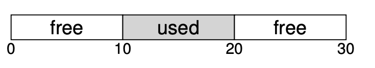
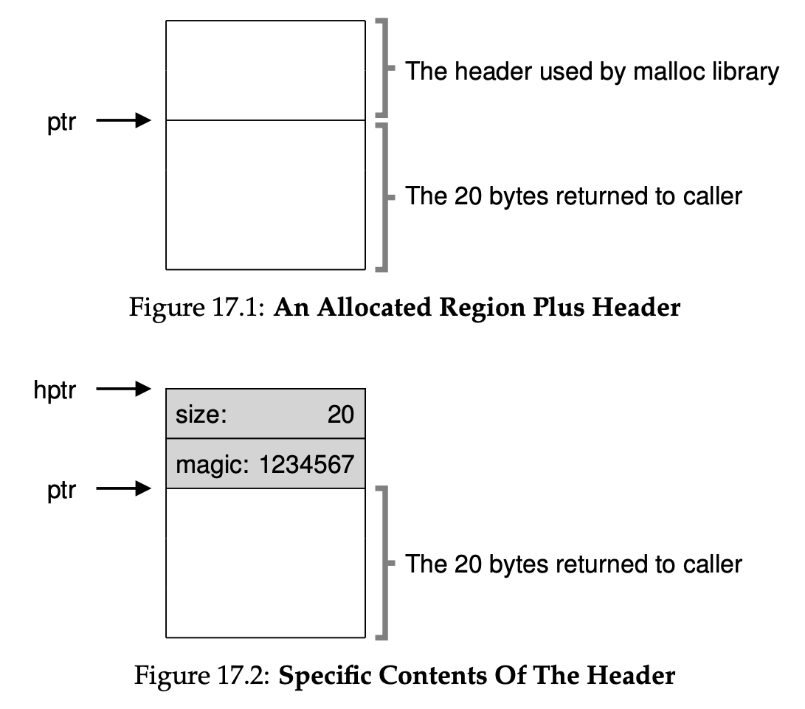

### Key Notes on Low-Level Mechanisms in Memory Allocators


#### 1. **Splitting and Coalescing**

- **Free List**: A structure that tracks free memory regions in the heap.
    - Example: A 30-byte heap with two free segments:
        - `head addr: 0, len: 10`
        - `addr: 20, len: 10 NULL`
    
- **Splitting**:
    - When a memory request is smaller than a free chunk, the allocator splits the chunk into two parts:
        - One part is allocated to the caller.
        - The remaining part stays in the free list.
    - Example:
        - Request for 1 byte from `addr: 20, len: 10`.
        - Result:
            - Allocated: `addr: 20, len: 1`
            - Free list: `head addr: 0, len: 10`, `addr: 21, len: 9 NULL`
            - As seen in figure below, address of 2 was given back to user and in free list address starting 21 is present.

- **Coalescing**:
    - When a chunk is freed, the allocator merges it with adjacent free chunks to form a larger contiguous block.
    - Example:
        - Freeing `addr: 10, len: 10` in a heap with:
            - `head addr: 0, len: 10`
            - `addr: 20, len: 10 NULL`
        - Without coalescing:
            - `head addr: 10, len: 10`, `addr: 0, len: 10`, `addr: 20, len: 10 NULL`
        - With coalescing:
            - `head addr: 0, len: 30 NULL`


### Key Notes: Tracking the Size of Allocated Regions

1. **Purpose of Header in Memory Allocation**:
    
    - Allocators store extra information in a **header block** located just before the allocated memory chunk.
    - This header helps determine the size of the memory region being freed during a `free()` call.
2. **Header Structure**:
    
    - A simple header may include:
        - **Size** of the allocated region.
        - A **magic number** for integrity checking.
    - Example structure:
        
```c
typedef struct {
	int size;
	int magic;
} header_t;
```
3. **Pointer Arithmetic for Header Access**:
    
    - When `free(ptr)` is called, the allocator uses pointer arithmetic to locate the header:
        - `header_t *hptr = (header_t *) ptr - 1;`
    - This allows the library to:
        - Verify the magic number for sanity checks.
        - Calculate the total size of the freed region.
4. **Size Calculation**:
    - The size of the free region includes:
        - The size of the **header**.
        - The size of the **user-allocated memory**.
    - When a user requests `N` bytes, the allocator searches for a free chunk of size **N + header size**.
5. **Sanity Check**:
    
    - The magic number in the header is used to ensure memory integrity:
        - Example: `assert(hptr->magic == 1234567)`.
6. **Key Detail**:    
    - The library does not allocate exactly the requested size (`N`) but slightly more to account for the header.


#### 3. **Free Space Management**

- A simple list is built inside the free space to track which regions are free and which are allocated.
- Efficient management ensures better utilization of memory and avoids fragmentation.

#### 4. **Benefits of Coalescing**

- Prevents fragmentation by merging adjacent free chunks.
- Ensures larger contiguous memory blocks are available for allocation.
- Example:
    - Without coalescing, a 20-byte request would fail in a fragmented heap.
    - With coalescing, the allocator can satisfy larger requests.

These mechanisms—splitting, coalescing, and free space tracking—are foundational to most memory allocators, ensuring efficient memory usage and reducing fragmentation.