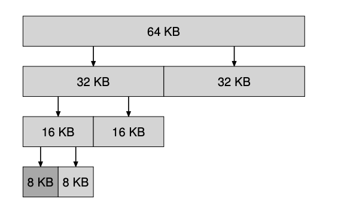

### Key Notes on Buddy Allocation

1. **Concept Overview**:
    
    - Buddy allocation simplifies memory coalescing.
    - Free memory is treated as a single large block of size 2^N.
    - Memory requests recursively divide the free space into halves until a sufficiently large block is found.
2. **Allocation Process**:
    
    - Blocks are split into power-of-two sizes.
    - Internal fragmentation can occur since only power-of-two-sized blocks are allocated.
    - Example: A 64KB space is divided to allocate a 7KB request, resulting in an 8KB block being allocated.

1. **Coalescing Mechanism**:
    
    - When a block is freed, the allocator checks if its "buddy" (block of the same size) is also free.
    - If the buddy is free, the two blocks are merged (coalesced) into a larger block.
    - This process continues recursively up the tree until no further coalescing is possible or the entire space is restored.
2. **Buddy Identification**:
    
    - Buddies are easily identified as their addresses differ by a single bit.
    - The specific bit difference corresponds to the level in the buddy tree.
3. **Advantages**:
    
    - Efficient coalescing due to the simple buddy identification process.
    - Reduces fragmentation by merging adjacent free blocks.
4. **Limitations**:
    
    - Suffers from internal fragmentation as only power-of-two-sized blocks can be allocated.

### Key Notes for Quick Review:

#### 1. **Scaling Challenges in Memory Allocation**:

- Searching lists in memory allocation can be slow and lacks scalability.
- Advanced allocators address these issues by using more complex data structures, such as:
    - **Balanced binary trees**
    - **Splay trees**
    - **Partially-ordered trees** ([W+95]).

#### 2. **Performance Optimization for Multi-Processor Systems**:

- Modern systems with multiple processors and multi-threaded workloads require efficient memory allocators.
- Significant efforts have been made to optimize allocators for such systems.
- Notable examples:
    - **Berger et al.** ([B+00])
    - **Evans** ([E06]).

#### 3. **Exploration of Memory Allocator Ideas**:

- Thousands of ideas have been developed over time for memory allocators.
- For further understanding:
    - Study the **glibc allocator** ([S15]) to see how real-world allocators function.
    - Explore additional resources for deeper insights into memory allocation techniques.