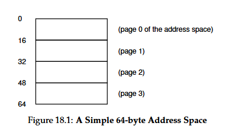
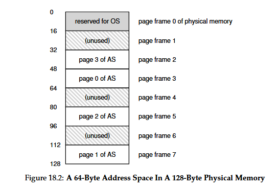
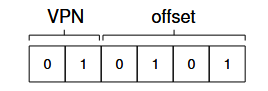
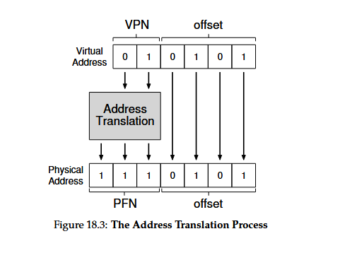

### **Paging: Introduction**

**1. Two Approaches to Space Management**

- **Variable-sized allocation:**
    
    - Example: _Segmentation_ in virtual memory.
        
    - **Problem:** Leads to **fragmentation**, making allocation difficult over time.
        
- **Fixed-sized allocation:**
    
    - Example: _Paging._
        
    - Avoids fragmentation by dividing space into equal-sized pieces.
        

**2. Paging Concept**

- **Virtual memory** is divided into **fixed-size blocks** called **pages**.
    
- **Physical memory** is divided into **page frames**, each the same size as a page.
    
- Each **page frame** holds exactly **one page** from a process.
    

**3. Goal / Challenge**

- **Crux:** How to virtualize memory efficiently using pages.
    
- Must achieve:
    
    - Avoidance of fragmentation problems from segmentation.
        
    - Minimal **space overhead** (page tables, metadata).
        
    - Minimal **time overhead** (translation speed, memory access).
        

**4. Historical Note**

- Paging concept originated from the **Atlas computer system** (early 1960s).

### **Paging: Simple Example and Overview**

**1. Example Setup**

- Virtual address space: **64 bytes**, divided into **4 pages** (16 bytes each).

- Physical memory: **128 bytes**, divided into **8 page frames**.
    
- Each virtual page can be placed in any physical frame.

**2. Advantages of Paging**

- **Flexibility:** No assumptions about stack/heap growth direction or layout.
    
- **Simplified memory management:** OS just finds any free physical pages from a free list.
    
- **Isolation:** Each process has its own address space and page table.
    

**3. Page Table**

- **Purpose:** Maps virtual pages (VPN) to physical frames (PFN).
    
- **Per-process structure:** Each process has its own page table.
    
- **Example mapping:**
    
    - VP0 → PF3
        
    - VP1 → PF7
        
    - VP2 → PF5
        
    - VP3 → PF2
        

**4. Address Translation Process**

- Virtual address split into:
    
    - **VPN (Virtual Page Number)** – identifies which page.
        
    - **Offset** – identifies byte within that page.
        
- Example:
    
    - 64-byte address space → needs **6 bits** (2⁶ = 64).
        
    - Page size = 16 bytes → needs **4 bits for offset**, **2 bits for VPN**.
        

**5. Example Translation**

- Virtual address = **21 (binary 010101)**

    - VPN = `01` → Virtual Page 1
        
    - Offset = `0101` (5th byte)
        
- From page table: VP1 → PF7 (`111` in binary).
    
- Replace VPN with PFN → Physical address = `1110101` (decimal 117).

- Offset remains unchanged.
    

**6. Key Concepts**

- **Offset** is not translated — it directly indexes within a page.
    
- **Page Table** enables mapping of virtual to physical addresses.
    
- Paging allows the OS to efficiently manage memory for multiple processes.
    

**7. Leads to Further Questions**

- Where are page tables stored?
    
- What do they contain?
    
- How large are they, and what is the performance cost?
