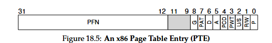

### **18.3 What’s Actually in the Page Table**

**1. Purpose of the Page Table**

- Maps **virtual page numbers (VPNs)** → **physical frame numbers (PFNs)**.
    
- Implemented as a **data structure** (usually an array).
    
- **Linear page table:** simplest form — array indexed by VPN to get PTE (page table entry).
    

---

**2. Page Table Entry (PTE) – Main Components**  
Each **PTE** holds information about a page and its status:

|**Bit / Field**|**Meaning / Purpose**|
|---|---|
|**PFN**|Physical Frame Number – actual physical page location.|
|**Valid bit**|Indicates if the mapping is valid. If invalid and accessed → causes a **trap** (page fault). Supports **sparse address spaces** and saves memory.|
|**Protection bits (R/W/X)**|Controls access permissions – read, write, execute. Violations → trap to OS.|
|**Present bit (P)**|Indicates if the page is **in memory** or **swapped to disk**.|
|**Dirty bit (D)**|Set if the page has been **modified** since loaded into memory.|
|**Reference bit (A)**|Tracks if the page has been **recently accessed** — used in **page replacement** algorithms.|
|**User/Supervisor bit (U/S)**|Determines whether **user-mode** or **kernel-mode** can access the page.|
|**Cache control bits (PWT, PCD, PAT, G)**|Manage caching behavior at the hardware level.|

