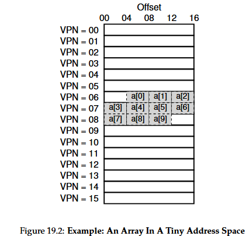
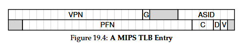

## 🧠 Chapter 19 — Paging: Faster Translations (TLBs)

### 🔹 The Problem: Paging Performance Overhead

- Paging divides memory into small, fixed-size pages.
    
- Each memory access needs a virtual-to-physical translation.
    
- Since page tables are stored in main memory, every memory reference requires:
    
    - One lookup for the page table, and
        
    - One lookup for the actual memory access.
        
- This **doubles memory accesses** and slows performance drastically.
    

**Crux:**

> How can we speed up address translation and avoid the extra memory reference paging requires?

---

## 🔹 The Solution: Translation Lookaside Buffer (TLB)

- TLB is a **hardware cache** inside the **MMU (Memory Management Unit)**.
    
- It stores **recently used virtual-to-physical address translations**.
    
- When the CPU needs to translate an address:
    
    - It first checks the TLB.
        
    - If found (**TLB hit**) → translation is instant.
        
    - If not found (**TLB miss**) → page table is accessed and TLB is updated.
        

**Without TLBs**, virtual memory would be too slow for practical systems.

## 🔹 TLB Control Flow (Hardware-Managed)

```c
VPN = (VirtualAddress & VPN_MASK) >> SHIFT
(Success, TlbEntry) = TLB_Lookup(VPN)
if (Success == True)              // TLB Hit
    if (CanAccess(TlbEntry.ProtectBits))
        Offset = VirtualAddress & OFFSET_MASK
        PhysAddr = (TlbEntry.PFN << SHIFT) | Offset
        Register = AccessMemory(PhysAddr)
    else
        RaiseException(PROTECTION_FAULT)
else                             // TLB Miss
    PTEAddr = PTBR + (VPN * sizeof(PTE))
    PTE = AccessMemory(PTEAddr)
    if (PTE.Valid == False)
        RaiseException(SEGMENTATION_FAULT)
    else if (CanAccess(PTE.ProtectBits) == False)
        RaiseException(PROTECTION_FAULT)
    else
        TLB_Insert(VPN, PTE.PFN, PTE.ProtectBits)
        RetryInstruction()

```

### Explanation

1. Extract **VPN** from virtual address.
    
2. Check TLB for translation.
    
3. **On TLB Hit:**  
    → Combine PFN + Offset → Get Physical Address → Access memory.
    
4. **On TLB Miss:**  
    → Access page table, check validity & protection.  
    → Update TLB, retry instruction.  
    → This second try will hit the TLB.

## 🔹 TLBs as Caches

- Based on **temporal** and **spatial locality**.
    
    - **Temporal locality:** recently accessed addresses will be used again soon.
        
    - **Spatial locality:** nearby addresses will be accessed soon.
        
- TLBs are **small and fast** because physical limits (speed-of-light, chip size) make large caches slower.

## 🔹 Example: Accessing an Array

Assume:

- Array of 10 integers (4 bytes each) starting at virtual address `100`.
    
- Virtual address space: 8-bit.
    
- Page size: 16 bytes (4-bit VPN + 4-bit offset).
    

Memory layout:

| Page (VPN) | Array elements |
| ---------- | -------------- |
| 6          | a[0]–a[2]      |
| 7          | a[3]–a[6]      |
| 8          | a[7]–a[9]      |


### Access Pattern:

```
- miss (First element access will not be in cache, so it fetches and updates cache), 
- hit, hit, ( a[1] and a[2] in same page)
- miss, hit, hit, hit, miss, hit, hit

```

→ **TLB hit rate = 70%**

Shows **spatial locality**: elements close in memory share the same page.  
With larger pages, even fewer TLB misses occur.

If the array is accessed again soon, **temporal locality** ensures nearly 100% hit rate.

## 🔹 Who Handles TLB Misses?

### Two Approaches

1. **Hardware-managed TLB (CISC, e.g., x86):**
    
    - Hardware “walks” the page table automatically.
        
    - Uses a base register (e.g., CR3 holds pointer to first part of page table).
        
    - Fully handled by hardware.
        
2. **Software-managed TLB (RISC, e.g., MIPS, SPARC):**
    
    - Hardware raises an exception (`TLB_MISS`).
        
    - OS trap handler looks up translation and updates TLB.
        
    - Execution resumes at **same instruction** (not next one).
        

**Advantages of software-managed TLBs:**

- More flexible: OS can choose any page table structure.
    
- Simpler hardware.
    

**Caution:**  
OS must ensure TLB miss handler itself doesn’t cause more TLB misses (e.g., keep handler in unmapped physical memory or reserved TLB entries).


### 🔸 RISC vs. CISC

- **CISC:** Complex, high-level instructions; compact code.
    
- **RISC:** Simple, uniform instructions; faster execution; compiler-friendly.
    
- Modern CPUs (e.g., Intel) blend both approaches internally.


## TLB Valid Bit vs. Page Table Valid Bit

| Bit                      | Meaning                                                                                                 |
| ------------------------ | ------------------------------------------------------------------------------------------------------- |
| **Page Table Valid Bit** | If invalid → page not allocated → segmentation fault.                                                   |
| **TLB Valid Bit**        | Whether entry has a valid cached translation. Initially all invalid at boot. Cleared on context switch. |

## 🔹 TLB Contents

A typical TLB entry contains:

| Field           | Description           |
| --------------- | --------------------- |
| VPN             | Virtual Page Number   |
| PFN             | Physical Frame Number |
| Valid           | Is translation valid? |
| Protection bits | r/w/x permissions     |
| ASID            | Address Space ID      |
| Dirty           | Written-to indicator  |
| Others          | Cache control, etc.   |

## 🔹 TLB and Context Switches

### Problem:

- TLB holds per-process translations.
    
- On context switch, new process may have **different page table**.
    
- Stale TLB entries cause wrong mappings.
    

### Solutions:

1. **Flush TLB on every context switch:**
    
    - Simple but costly (repopulation needed).
        
2. **Use Address Space Identifiers (ASIDs):**
    
    - Each TLB entry tagged with ASID (similar to PID).
        
    - TLB can safely hold entries from multiple processes.
        

Example with ASIDs:

|VPN|PFN|valid|prot|ASID|
|---|---|---|---|---|
|10|100|1|rwx|1|
|10|170|1|rwx|2|
→ Both processes can coexist in the TLB without confusion.

**Shared Pages Example:**  
Two different VPNs map to the same physical page (e.g., shared code).

## 🔹 TLB Replacement Policy

**Crux:** Which entry to replace when inserting a new one?

### Common Policies:

- **LRU (Least Recently Used):**  
    Evicts least recently used entry.
    
- **Random:**  
    Evicts a random entry — simple and avoids pathological loops (where LRU fails)

## 🔹 Real Example: MIPS R4000 TLB




| Field | Bits | Description                                                |
| ----- | ---- | ---------------------------------------------------------- |
| VPN   | 19   | Virtual Page Number (only half address space used by user) |
| G     | 1    | Global bit — ignore ASID if set                            |
| ASID  | 8    | Address Space Identifier                                   |
| PFN   | 24   | Physical Frame Number (supports 64GB physical memory)      |
| C     | 3    | Cache coherency bits                                       |
| D     | 1    | Dirty bit                                                  |
| V     | 1    | Valid bit                                                  |
- **32 or 64 entries total.**
    
- Some reserved for OS (“wired” entries for handlers).
    
- **MIPS instructions to control TLB:**
    
    - `TLBP`: Probe TLB for entry
        
    - `TLBR`: Read TLB entry
        
    - `TLBWI`: Write indexed entry
        
    - `TLBWR`: Write random entry
        

All are **privileged instructions**.

### ⚠️ Tip: Culler’s Law

> RAM isn’t always RAM.  
> Accessing memory may vary in cost depending on whether the page is in the TLB.  
> Randomly accessing many pages can cause frequent TLB misses and severe slowdown.


## 🔹 Summary

- TLBs drastically speed up address translation by caching mappings.
    
- Hit = Fast, Miss = Slow (extra memory access for page table).
    
- Common case: hits → virtual memory becomes efficient.
    
- Problems arise when:
    
    - Number of pages exceeds TLB capacity (**exceeding TLB coverage**).
        
    - Frequent context switches without ASIDs.
        
- Large pages and ASIDs can improve performance and efficiency.


