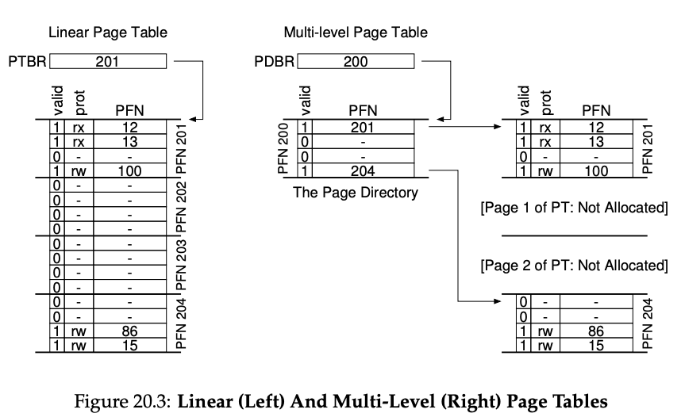

### Comprehensive Answer: Hybrid Approach - Paging and Segments

The hybrid approach of combining paging and segmentation, as well as the concept of **multi-level page tables**, addresses the challenges of memory management in modern systems by leveraging the strengths of both techniques. Below is a detailed explanation of the key concepts:

---

### **1. Hybrid Approach: Paging and Segments**

The hybrid approach combines **segmentation** and **paging** to manage memory efficiently. Here's how it works:

- **Segmentation** divides the memory into logical segments (e.g., code, stack, heap), each with its own base and limit. This provides a logical view of memory and allows for better isolation and protection.
- **Paging** divides each segment into fixed-size pages, which are mapped to physical memory frames. This eliminates external fragmentation and simplifies memory allocation.

In this approach:

- Each segment has its own page table.
- The logical address is divided into three parts: **segment number**, **page number**, and **offset**.
- The segment number is used to locate the segment descriptor, which contains the base address of the page table for that segment.
- The page number is used to index into the page table to find the physical frame.
- The offset is added to the frame address to get the final physical address.

This hybrid approach combines the flexibility of segmentation with the simplicity and efficiency of paging.

---

### **2. Multi-Level Page Tables**

The **multi-level page table** is a hierarchical structure that optimizes memory usage by avoiding the need to allocate space for invalid or unused regions of the address space. Here's how it works:

#### **Key Concepts**

- **Page Directory**: The top-level structure that tracks the validity and location of pages in the page table. Each entry in the page directory is called a **Page Directory Entry (PDE)**.
- **Page Table**: A lower-level structure that maps virtual page numbers (VPNs) to physical frame numbers (PFNs). Each entry in the page table is called a **Page Table Entry (PTE)**.

#### **How It Works**

1. **Chopping the Page Table**: The linear page table is divided into smaller, page-sized units.
2. **Page Directory**: Instead of keeping all page table entries in memory, the page directory tracks which pages of the page table are valid and where they are stored in memory.
3. **On Access**:
    - The virtual address is divided into three parts: **page directory index**, **page table index**, and **offset**.
    - The page directory index is used to locate the PDE.
    - If the PDE is valid, it points to the corresponding page table.
    - The page table index is used to locate the PTE.
    - If the PTE is valid, it points to the physical frame.
    - The offset is added to the frame address to get the final physical address.

#### **Advantages**

- **Compactness**: Only allocates memory for the parts of the address space that are in use, making it ideal for sparse address spaces.
- **Ease of Management**: Each portion of the page table fits neatly within a page, simplifying memory allocation and management.
- **Flexibility**: Pages of the page table can be placed anywhere in physical memory, avoiding the need for large contiguous memory blocks.

#### **Disadvantages**

- **Performance Overhead**: On a TLB miss, two memory accesses are required (one for the page directory and one for the page table), compared to one access in a linear page table.
- **Increased Complexity**: The lookup process is more complex, requiring additional hardware or OS logic.

#### **Time-Space Trade-Off**

The multi-level page table reduces memory usage at the cost of increased lookup time on a TLB miss. This trade-off is acceptable in most systems because TLB hits are common, and the memory savings are significant.

---

### **3. Comparison: Linear vs. Multi-Level Page Tables**

|**Aspect**|**Linear Page Table**|**Multi-Level Page Table**|
|---|---|---|
|**Memory Usage**|Allocates space for the entire address space, even unused regions.|Allocates space only for used regions, saving memory.|
|**Contiguity**|Requires a large contiguous block of memory.|Pages of the page table can be placed anywhere in memory.|
|**Lookup Time**|Faster (one memory access on TLB miss).|Slower (two memory accesses on TLB miss).|
|**Complexity**|Simple to implement.|More complex due to hierarchical structure.|
|**Suitability**|Suitable for dense address spaces.|Ideal for sparse address spaces.|

---

### **4. Practical Implications**

- **Modern Systems**: Multi-level page tables are widely used in modern architectures (e.g., x86) because they efficiently handle large, sparse address spaces.
- **Hybrid Approach**: Combining segmentation and paging provides both logical memory organization and efficient physical memory usage.
- **Performance Optimization**: Techniques like TLBs (Translation Lookaside Buffers) mitigate the performance overhead of multi-level page tables by caching frequently used translations.

---

### **Summary**

The hybrid approach of segmentation and paging, combined with multi-level page tables, provides a powerful and flexible solution for memory management. It balances the trade-offs between memory usage, performance, and complexity, making it a cornerstone of modern operating systems and hardware architectures.

