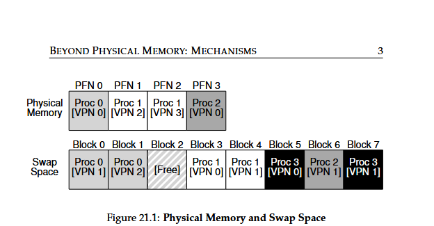

NOTE: Notes generated using LLM.
# 🧠 Beyond Physical Memory: Mechanisms

> Notes based on _Operating Systems: Three Easy Pieces_ — Chapter 21  
> Topic: How operating systems manage memory beyond physical limits using **virtual memory and swapping.**

---

## 1. Motivation — Why Go Beyond Physical Memory?

- Until now, we assumed:
    
    - Each process’s **address space fits entirely in physical memory.**
        
    - All active processes have all pages resident in memory.
        
- This is unrealistic — we need to handle **large address spaces** and **many concurrent processes.**
    

### 🧩 The Core Problem (The Crux)

> **How can the OS use a larger, slower device (like a disk) to create the illusion of a large virtual address space?**

- Large address spaces make programming easier — developers can allocate memory freely without worrying about hardware limits.
    
- Historically, programmers manually swapped parts of code/data in and out (called **memory overlays**).
    
    - Modern OSes automate this through **virtual memory** and **swapping**.
        

---

## 2. Storage Technologies Overview

- The “larger, slower device” can be:
    
    - **Hard Disk Drive (HDD)**
        
    - **Solid-State Drive (SSD)** — faster, modern replacement.
        
- The **memory hierarchy** now includes:
    
    - Fast but small **main memory (RAM)**
        
    - Large but slow **secondary storage (disk/SSD)**
        
- Goal: Transparently extend memory beyond what physically exists.
    

---

## 3. Swap Space

### 🧱 Definition

- **Swap space**: A reserved area on disk used to **store memory pages** that are not currently needed in RAM.
    

### 💾 Mechanism

- OS can:
    
    - **Swap out** pages (RAM ➜ disk)
        
    - **Swap in** pages (disk ➜ RAM)
        
- The OS tracks **disk addresses** for swapped pages.
    

### 🧮 Example

- Suppose:



    
    - Physical memory: 4 pages
        
    - Swap space: 8 pages
        
- Multiple processes share RAM, but their other pages live in swap.
    
- Example state:
    
    - `Proc 0`: Partially in memory
        
    - `Proc 3`: Entirely swapped out
        
- The system **pretends** to have more memory than physically available.
    

### 📦 Code and File Pages

- Code pages (e.g., from a program binary like `/bin/ls`) can be reloaded from disk if needed.
    
- Thus, not all swap I/O goes to dedicated swap space — some may read from program binaries or file-backed pages.
    

---

## 4. The Present Bit

### 🧩 Purpose

- A new flag in the **Page Table Entry (PTE)** indicating if a page is in physical memory.
    

|Bit|Meaning|
|---|---|
|`Present = 1`|Page is in RAM|
|`Present = 0`|Page is on disk|


### 🧠 Control Flow

- On each memory reference:
    
    - CPU extracts **VPN (Virtual Page Number)**.
        
    - Checks **TLB (Translation Lookaside Buffer)**:
        
        - **Hit** → use PFN to access memory.
            
        - **Miss** → check **page table**.
            
- If page is **valid and present**, use PFN.
    
- If **present bit = 0**, page is **not in memory** → triggers a **page fault.**, Yes Page Fault, even if page is present in Disk.
    

---

## 5. Page Faults

### ⚙️ What Happens During a Page Fault

1. The **OS page-fault handler** takes control.
    
2. Finds the **page’s location on disk** (often stored in the PTE).
    
3. Reads the page from disk into a free physical frame.
    
4. Updates the PTE:
    
    - Sets `Present = 1`
        
    - Updates the `PFN`
        
5. Retries the instruction (which now hits in TLB).
    

### ⏳ Process State

- While waiting for I/O, the process is **blocked**.
    
- The OS schedules another process → improves utilization.
    

---

## 6. Why the OS Handles Page Faults (Not Hardware)

- Hardware doesn’t manage disk I/O or swap space.
    
- Disk I/O is slow — OS handling overhead is negligible.
    
- Hardware only raises the exception; OS manages the rest.
    

---

## 7. What If Memory Is Full?

When no free frames are available:

- The OS must **evict** some pages to make space.
    
- The decision policy is called the **page-replacement policy.**
    
    - A poor choice can severely degrade performance (up to 100,000× slower).
        
- Replacement algorithms (e.g., LRU, FIFO) are discussed in the next chapter.
    

---

## 8. Page-Fault Control Flow

### 🧮 Hardware Side (Simplified)

```
1  VPN = (VirtualAddress & VPN_MASK) >> SHIFT
2  (Success, TlbEntry) = TLB_Lookup(VPN)
3  if (Success) and (CanAccess(...)):
       Use PFN to fetch data
4  else:
       PTE = AccessMemory(PTBR + VPN * sizeof(PTE))
       if (!PTE.Valid): SEGMENTATION_FAULT
       else if (!PTE.CanAccess): PROTECTION_FAULT
       else if (PTE.Present): Insert into TLB, Retry
       else: PAGE_FAULT

```

### 🧰 OS Side (Software Page-Fault Handler)
```
1  PFN = FindFreePhysicalPage()
2  if (PFN == -1): PFN = EvictPage()
3  DiskRead(PTE.DiskAddr, PFN)
4  PTE.present = True
5  PTE.PFN = PFN
6  RetryInstruction()

```

## 9. When Replacements Really Occur

### 🧍‍♂️ The Swap Daemon / Page Daemon

- OS doesn’t wait until RAM is 100% full.
    
- Uses **watermarks**:
    
    - **High watermark (HW)** — number of free pages to maintain.
        
    - **Low watermark (LW)** — when free pages drop below this, start evicting.
        
- A **background thread** (swap daemon) runs:
    
    - Evicts pages until HW is reached.
        
    - Then sleeps until memory runs low again.
        

### ⚙️ Performance Optimization

- Evicting in **batches** allows **clustering** (writing multiple pages together to disk).
    
    - Reduces **seek** and **rotational delays** on HDDs.
        
    - Greatly improves swap performance.
        

---

## 💡 Tip: Do Work in the Background

Background operations (like swap or buffered writes):

- Increase disk efficiency by grouping writes.
    
- Improve apparent latency.
    
- Allow better use of **idle CPU time.**
    

---

## 10. Summary

|Concept|Description|
|---|---|
|**Swap Space**|Disk area used to store non-resident pages.|
|**Present Bit**|Indicates whether a page is in physical memory.|
|**Page Fault**|Occurs when a process accesses a page not in memory.|
|**Page-Fault Handler**|OS code that loads the missing page from disk.|
|**Replacement Policy**|Decides which page to evict when memory is full.|
|**Swap Daemon**|Background process maintaining free pages using HW/LW thresholds.|

### 🧩 Key Takeaway

> Virtual memory allows programs to use more memory than physically exists —  
> with the OS dynamically managing pages between RAM and disk, **completely transparent to the process.**

---

## 🧪 Homework Summary (Measurement)

Use the `vmstat` tool and `mem.c` program to explore swapping behavior.

| Task                                      | Concept Explored                                     |
| ----------------------------------------- | ---------------------------------------------------- |
| Run `vmstat 1` while executing `mem`      | Observe CPU and memory usage                         |
| Run `./mem 1`, `./mem 1024`               | See how free and swap memory changes                 |
| Check `/proc/meminfo`                     | Determine total available memory                     |
| Observe `si` and `so` columns             | Swap-in and swap-out activity                        |
| Compare in-memory vs swapping performance | Analyze impact on bandwidth and latency              |
| Use `swapon -s`                           | Check available swap space                           |
| Experiment with different swap devices    | Measure performance differences (HDD vs SSD vs RAID) |

## 📚 References

- **[D97]** Peter Denning, _Before Memory Was Virtual_ (1997)
    
- **[LL82]** Hank Levy, P. Lipman, _Virtual Memory Management in the VAX/VMS Operating System_
    
- **[G+95]** Golding et al., _Idleness is not sloth_ (USENIX ATC ‘95)
    
- **[CS94]** Corbato & Steinberg, _Origin of “daemon” term in computing_
