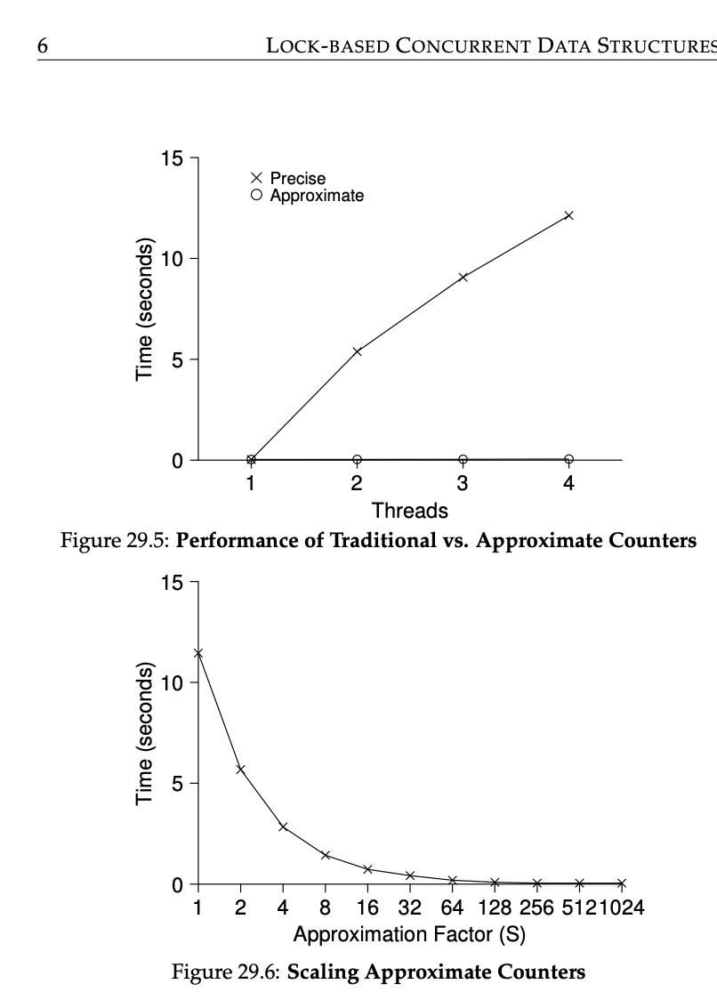

### Key Notes for Quick Review: Scalable Counting with Approximate Counters

#### 1. **Introduction to Scalable Counting**

- Scalable counters are crucial for improving performance on multicore systems, as non-scalable counters can cause significant contention and performance degradation.
- **Approximate Counters**: A technique to improve scalability by using multiple local counters (one per CPU core) and a single global counter.
    - Local counters are updated frequently, while the global counter is updated periodically.
    - This reduces contention on the global counter and improves scalability.

---

#### 2. **How Approximate Counters Work**

- Each CPU core has its own **local counter** and **local lock**.
- A **global counter** and a **global lock** are used to maintain an approximate total count.
- **Update Process**:
    - A thread updates its local counter by acquiring the corresponding local lock.
    - When the local counter reaches a predefined **threshold (S)**, its value is transferred to the global counter:
        - The global lock is acquired.
        - The local counter value is added to the global counter.
        - The local counter is reset to zero.
        - The global lock is released.
- **Accuracy vs. Performance Tradeoff**:
    - A smaller threshold (S) results in more accurate global counts but higher contention and lower performance.
    - A larger threshold (S) improves performance but reduces the accuracy of the global count.

---

#### 3. **Code Example: Approximate Counter Implementation**

```c
#include <pthread.h>

#define NUMCPUS 4

typedef struct __counter_t {
    int global; // global count
    pthread_mutex_t glock; // global lock
    int local[NUMCPUS]; // per-CPU count
    pthread_mutex_t llock[NUMCPUS]; // local locks
    int threshold; // update frequency
} counter_t;

// Initialize counter
void init(counter_t *c, int threshold) {
    c->threshold = threshold;
    c->global = 0;
    pthread_mutex_init(&c->glock, NULL);
    for (int i = 0; i < NUMCPUS; i++) {
        c->local[i] = 0;
        pthread_mutex_init(&c->llock[i], NULL);
    }
}

// Update counter
void update(counter_t *c, int threadID, int amt) {
    int cpu = threadID % NUMCPUS; // Determine local counter to update
    pthread_mutex_lock(&c->llock[cpu]);
    c->local[cpu] += amt;
    if (c->local[cpu] >= c->threshold) {
        // Transfer local counter to global counter
        pthread_mutex_lock(&c->glock);
        c->global += c->local[cpu];
        pthread_mutex_unlock(&c->glock);
        c->local[cpu] = 0;
    }
    pthread_mutex_unlock(&c->llock[cpu]);
}

// Get global counter value (approximate)
int get(counter_t *c) {
    pthread_mutex_lock(&c->glock);
    int val = c->global;
    pthread_mutex_unlock(&c->glock);
    return val; // Approximate value
}
```

---

#### 4. **Example of Approximate Counter in Action**

- **Threshold (S)**: Determines how often local counters are transferred to the global counter.
- **Example**:
    - With 4 CPUs and a threshold of `S = 5`:
        - Each CPU increments its local counter.
        - When the local counter reaches 5, its value is added to the global counter, and the local counter is reset.
    - Example trace of counter updates:

|Time|L1|L2|L3|L4|G|
|---|---|---|---|---|---|
|0|0|0|0|0|0|
|1|0|0|1|1|0|
|2|1|0|2|1|0|
|3|2|0|3|1|0|
|4|3|0|3|2|0|
|5|4|1|3|3|0|
|6|5→0|1|3|4|5|
|7|0|2|4|5→0|10|

---

#### 5. **Performance of Approximate Counters**

- **Benchmark Results**:
    - With a threshold `S = 1024`, performance is excellent.
    - Time to update the counter 4 million times on 4 CPUs is nearly the same as updating it 1 million times on 1 CPU.
- **Impact of Threshold (S)**:
    - Low `S`: Poor performance but high accuracy.
    - High `S`: Excellent performance but less accurate global count (error up to `S * NUMCPUS`).

#### 6. **Key Takeaways**

- Approximate counters significantly improve scalability by reducing contention on the global lock.
- The **threshold (S)** is a critical parameter that balances accuracy and performance.
- **Tradeoff**: Higher thresholds improve performance but reduce the accuracy of the global count.
- **Best Practice**: Test both simple and complex designs to determine which offers better performance for your specific workload.


