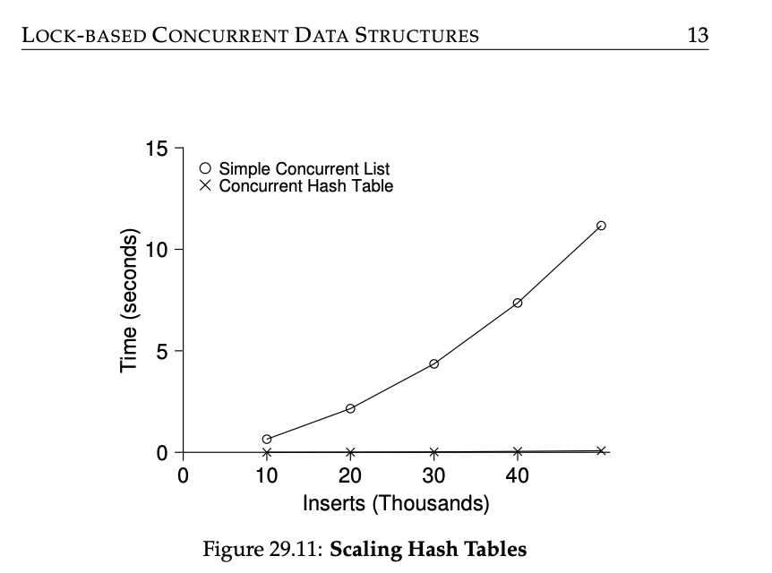

### Key Notes on 29.4 Concurrent Hash Table

#### Overview

- A **concurrent hash table** is a widely used data structure that allows multiple threads to perform operations concurrently.
- This implementation focuses on a **simple hash table** that does not support resizing. Adding resizing functionality requires additional work.
- The hash table is built using **concurrent lists** for each bucket, with each bucket having its own lock. This design allows multiple threads to operate on different buckets simultaneously, improving performance.

#### Key Features of the Concurrent Hash Table

1. **Bucket-based Design**:
    
    - The hash table consists of multiple buckets, each represented by a concurrent linked list.
    - The number of buckets is fixed and defined by the `BUCKETS` constant.
2. **Lock Per Bucket**:
    
    - Each bucket (list) has its own lock, enabling concurrent operations on different buckets without contention.
    - This design significantly improves scalability compared to a single-lock approach.
3. **Performance**:
    
    - The hash table scales well under concurrent updates, as shown in performance tests.
    - In contrast, a single-lock linked list does not scale effectively under heavy concurrent workloads.

#### Code Implementation

```c
#define BUCKETS (101)

typedef struct __hash_t {
    list_t lists[BUCKETS];
} hash_t;

void Hash_Init(hash_t *H) {
    int i;
    for (i = 0; i < BUCKETS; i++)
        List_Init(&H->lists[i]);
}

int Hash_Insert(hash_t *H, int key) {
    return List_Insert(&H->lists[key % BUCKETS], key);
}

int Hash_Lookup(hash_t *H, int key) {
    return List_Lookup(&H->lists[key % BUCKETS], key);
}
```

#### Key Points in the Code

1. **Initialization (`Hash_Init`)**:
    
    - The hash table is initialized with a fixed number of buckets (`BUCKETS`).
    - Each bucket is a concurrent list, and `List_Init` is called for each bucket to initialize it.
2. **Insert Operation (`Hash_Insert`)**:
    
    - The hash function (`key % BUCKETS`) determines the bucket where the key will be inserted.
    - The `List_Insert` function is called on the corresponding bucket to insert the key.
3. **Lookup Operation (`Hash_Lookup`)**:
    
    - The hash function (`key % BUCKETS`) determines the bucket where the key might be located.
    - The `List_Lookup` function is called on the corresponding bucket to search for the key.

#### Advantages

- **Scalability**: By using a lock per bucket, the hash table allows multiple threads to operate on different buckets concurrently, which significantly improves performance under high concurrency.
- **Simplicity**: The design is straightforward and leverages concurrent lists for each bucket.

#### Limitations

- **No Resizing**: The hash table does not support resizing, which can lead to performance degradation if the number of keys exceeds the number of buckets.
- **Hash Function Dependency**: The performance depends on the quality of the hash function. Poor hash functions can lead to uneven distribution of keys across buckets, causing contention.

#### Practical Advice

- To fully understand the implementation and its performance, it is recommended to test the hash table under various workloads and compare it with other data structures, such as a single-lock linked list.
- Consider implementing resizing functionality for scenarios where the number of keys may grow significantly.

#### Performance Comparison

- Performance tests (10,000 to 50,000 concurrent updates from four threads on a four-CPU system) show that the concurrent hash table scales well with increasing concurrency.
- In contrast, a single-lock linked list does not scale effectively, as all threads contend for the same lock.

