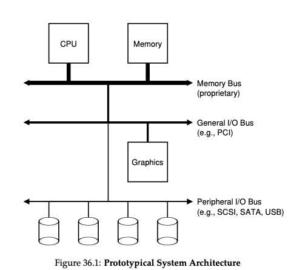
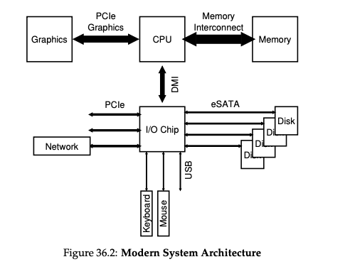

### Key Notes on I/O Devices and System Architecture

#### Importance of I/O in Computer Systems

- **I/O Devices**: Essential for computer systems to function meaningfully.
    - Input: Allows programs to receive data.
    - Output: Enables programs to produce results.
- **CRUX**: How to integrate I/O into systems efficiently and effectively.

---

#### System Architecture Overview

- **Classical System Architecture**:
    
    - **CPU**: Central processing unit connected to main memory via a high-performance memory bus.
    - **General I/O Bus**: Connects higher-performance devices (e.g., PCI or derivatives like PCIe).
    - **Peripheral I/O Bus**: Connects slower devices (e.g., SCSI, SATA, USB) like disks, mice, and keyboards.
    - **Hierarchy**:
        - High-performance devices (e.g., graphics cards) are closer to the CPU.
        - Lower-performance devices are further away, connected via peripheral buses.
    - **Reason for Hierarchy**:
        - Physics: Faster buses must be shorter.
        - Cost: High-performance buses are expensive to engineer.
    
    
- **Modern System Architecture**:
    
    - **Intel Z270 Chipset Example**:
        - **CPU**:
            - Directly connected to memory and graphics card for high-performance tasks (e.g., gaming, graphics-intensive applications).
        - **I/O Chip**:
            - Connected to the CPU via **DMI (Direct Media Interface)**.
            - Interfaces with various devices through different interconnects:
                - **eSATA**: For hard drives (evolution of ATA → SATA → eSATA for higher performance).
                - **USB**: For low-performance devices (e.g., keyboard, mouse).
                - **PCIe**: For high-performance devices (e.g., network interfaces, NVMe storage).
    

---

#### Figures

1. **Prototypical System Architecture**:
    
    - **Hierarchy**:
        - CPU ↔ Memory (via Memory Bus).
        - General I/O Bus (e.g., PCI) connects higher-performance devices.
        - Peripheral I/O Bus (e.g., SCSI, SATA, USB) connects slower devices.
    - **Diagram**:
        
        ```
        Graphics
        CPU ↔ Memory
        Memory Bus (proprietary)
        General I/O Bus (e.g., PCI)
        Peripheral I/O Bus (e.g., SCSI, SATA, USB)
        ```
        
2. **Modern System Architecture (Intel Z270 Chipset)**:
    
    - **Connections**:
        - CPU ↔ Memory and Graphics (via high-performance interconnect).
        - CPU ↔ I/O Chip (via DMI).
        - I/O Chip ↔ Devices:
            - eSATA: Hard drives.
            - USB: Keyboard, mouse.
            - PCIe: Network interface, NVMe storage.
    - **Diagram**:
        
        ```
        PCIe
        Graphics
        Memory
        Interconnect
        Graphics ↔ CPU ↔ Memory ↔ DMI ↔ I/O Chip
        eSATA: Disk, Disk, Disk, Disk
        USB: Keyboard, Mouse
        PCIe: Network
        ```
        

---

#### Key Takeaways

- **Hierarchical Design**: Balances performance and cost by placing high-performance devices closer to the CPU and slower devices further away.
- **Modern Enhancements**: Use of specialized chipsets and faster interconnects (e.g., PCIe, DMI) to improve system performance.
- **Device Interfaces**:
    - **eSATA**: Evolution of storage interfaces for higher performance.
    - **USB**: Standard for low-performance devices.
    - **PCIe**: High-performance interconnect for devices like NVMe storage and network interfaces.