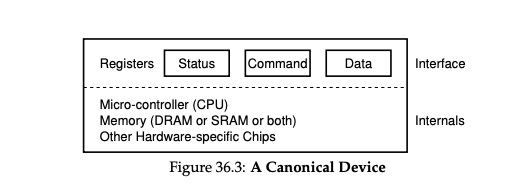

### Key Notes on "A Canonical Device"

1. **Definition of a Canonical Device**:
    
    - A canonical device is a conceptual model used to understand the machinery required for efficient device interaction.
    - It is not a real device but serves as a framework for understanding.
2. **Components of a Device**:
    
    - **Hardware Interface**:
        - The hardware interface is the part of the device that interacts with the rest of the system.
        - Similar to software, hardware must present an interface and protocol for system software to control its operation.
    - **Internal Structure**:
        - This is the implementation-specific part of the device.
        - It is responsible for realizing the abstraction the device presents to the system.
3. **Implementation Details**:
    
    - **Simple Devices**:
        - May consist of one or a few hardware chips to implement their functionality.
    - **Complex Devices**:
        - May include:
            - A simple CPU.
            - General-purpose memory.
            - Device-specific chips.
        - Example: Modern RAID controllers may have hundreds of thousands of lines of firmware (software within a hardware device) to implement their functionality.
4. **Purpose of the Canonical Device**:
    
    - To illustrate how devices interact with system software.
    - To highlight the importance of both the hardware interface and the internal structure in device design.




---

### Key Notes on "The Canonical Protocol"

#### Device Interface

- The device interface consists of three registers:
    1. **Status Register**: Read to check the current status of the device.
    2. **Command Register**: Write to instruct the device to perform a specific task.
    3. **Data Register**: Used to pass data to or retrieve data from the device.

#### Protocol Steps

1. **Wait for Device Readiness**:
    
    - The OS continuously reads the **status register** until the device is not busy.
    - This process is called **polling**.
    
    ```c
    While (STATUS == BUSY)
    ; // wait until device is not busy
    ```
    
2. **Send Data to Device**:
    
    - The OS writes data to the **data register**.
    - For example, if the device is a disk, multiple writes may be needed to transfer a block of data (e.g., 4KB).
    
    ```c
    Write data to DATA register
    ```
    
3. **Send Command to Device**:
    
    - The OS writes a command to the **command register**.
    - This action signals the device to start processing the command.
    
    ```c
    Write command to COMMAND register
    ```
    
4. **Wait for Device Completion**:
    
    - The OS polls the **status register** again to check if the device has completed the task.
    - The OS may also retrieve an error code to determine success or failure.
    
    ```c
    While (STATUS == BUSY)
    ; // wait until device is done with your request
    ```
    

#### Key Concepts

- **Polling**: The process of repeatedly checking the status register to determine the device's state.
- **Programmed I/O (PIO)**: When the CPU is directly involved in data movement between the OS and the device.

#### Advantages of the Protocol

- **Simplicity**: The protocol is straightforward and functional.

#### Disadvantages of the Protocol

1. **Inefficiency of Polling**:
    - Polling wastes CPU time by continuously checking the device status instead of performing other tasks.
    - This inefficiency could be mitigated by allowing the CPU to switch to another process while waiting for the device.

#### The Crux: Reducing Polling Costs

- **Challenge**: How can the OS manage device status without frequent polling to reduce CPU overhead?
- **Goal**: Develop mechanisms to avoid the inefficiencies of polling while maintaining effective device management.

[](https://rbcgithub.fg.rbc.com/pages/Innersource-Commons/helios-docs/docs/gremlin/experiment_types/resource_experiments)