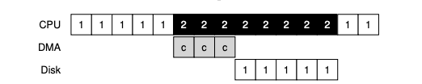

### Key Notes on "More Efficient Data Movement With DMA"

#### Problem with Programmed I/O (PIO)

- **CPU Overhead**: PIO requires the CPU to manually transfer data between memory and devices, one word at a time.
- **Inefficiency**: The CPU is overburdened with trivial tasks, wasting time that could be used for running other processes.
- **Timeline Example**:
    - Process 1 initiates I/O to write data to the disk.
    - The CPU explicitly copies data from memory to the device (marked as `c` in the timeline).
    - Only after the copy is complete does the I/O operation begin on the disk, freeing the CPU for other tasks.

#### The Crux: Reducing PIO Overheads

- **Challenge**: How to reduce the CPU's involvement in data movement to improve efficiency.
- **Solution**: Use **Direct Memory Access (DMA)**.

#### Direct Memory Access (DMA)

- **Definition**: A specialized hardware device (DMA engine) that manages data transfers between devices and main memory with minimal CPU intervention.
- **How DMA Works**:
    1. The OS programs the DMA engine with:
        - The memory location of the data.
        - The amount of data to transfer.
        - The target device for the transfer.
    2. Once programmed, the OS can proceed with other tasks.
    3. After the transfer is complete, the DMA controller raises an interrupt to notify the OS.

#### Benefits of DMA

- **Reduced CPU Involvement**: The DMA controller handles data copying, freeing the CPU for other tasks.
- **Improved Efficiency**: The CPU can execute other processes while the DMA engine manages data transfers.
- **Revised Timeline**:
    - Process 1 initiates I/O and programs the DMA engine.
    - The DMA controller handles the data transfer (marked as `c` in the timeline).
    - The CPU is free to run another process (e.g., Process 2) during the data transfer.

#### Timeline Comparison

|**Timeline with PIO**|**Timeline with DMA**|
|---|---|
|CPU is occupied copying data (marked `c`).|CPU is free while DMA handles data transfer.|
|Process 1 waits for the CPU to finish copying data before I/O begins.|Process 1 initiates DMA and the CPU can run Process 2 during the transfer.|
|CPU is underutilized for other tasks.|CPU is utilized more effectively.|

#### Key Takeaway

- **DMA significantly reduces CPU overhead** by offloading data transfer tasks, allowing the CPU to focus on other processes and improving overall system efficiency.

