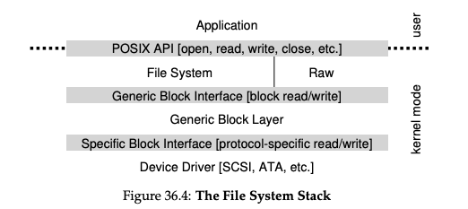

### Key Notes on "Fitting Into The OS: The Device Driver"

1. **Problem Statement: Device-Neutral OS Design**
    
    - The challenge is to design an OS that is device-neutral, allowing it to work with various devices (e.g., SCSI disks, IDE disks, USB drives) without being tied to their specific interfaces.
    - The goal is to hide the details of device interactions from major OS subsystems, such as the file system.
2. **Solution: Abstraction via Device Drivers**
    
    - Device drivers are specialized software components in the OS that handle the specific details of how a device works.
    - These drivers encapsulate device-specific interactions, allowing the rest of the OS to remain device-neutral.
3. **Linux File System Software Stack**
    
    - The Linux file system stack demonstrates how abstraction is implemented:
        - Applications and file systems issue generic block read/write requests to the **generic block layer**.
        - The generic block layer routes these requests to the appropriate **device driver**.
        - Device drivers handle the specific details of issuing requests to the hardware.
    - A **raw interface** is also provided for special applications (e.g., file-system checkers, disk defragmentation tools) to directly read/write blocks without using the file abstraction.
4. **Downsides of Abstraction**
    
    - **Loss of Special Capabilities**: Devices with advanced features (e.g., SCSI devices with rich error reporting) may lose their unique capabilities when forced to conform to a generic interface. For example:
        - SCSI devices provide detailed error reporting.
        - However, due to the simpler error handling of other devices (e.g., ATA/IDE), the OS only receives a generic error code (e.g., `EIO` for generic I/O error), losing the additional details.
5. **Device Drivers and OS Code**
    
    - Device drivers constitute a significant portion of the OS codebase:
        - In Linux, over **70% of the kernel code** is in device drivers.
        - For Windows, the percentage is also likely very high.
    - Despite the large codebase, only a small subset of drivers is active at any given time, depending on the connected devices.
6. **Challenges with Device Drivers**
    
    - Many device drivers are written by "amateurs" rather than full-time kernel developers.
    - This often results in a higher number of bugs in device drivers, making them a primary cause of kernel crashes.

