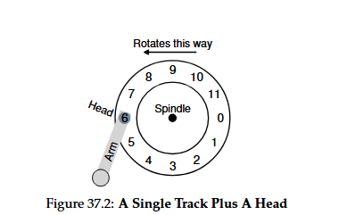
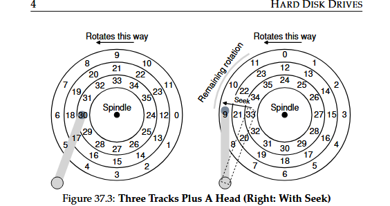
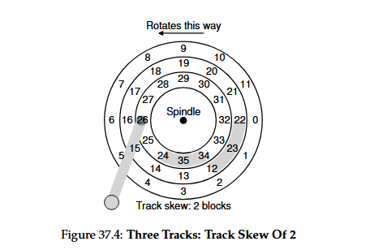

# Hard Disk Drives — Summary Notes

## 1. Overview  
Hard disk drives (HDDs) are the dominant form of persistent storage. Their design heavily influences filesystem behavior, performance, and OS scheduling decisions.

**Core questions:**
- How does a hard disk store data?
- How is data laid out and accessed?
- Why does scheduling matter?

## 2. Disk Interface  
Modern disks present a simple block-based interface:

- **Sectors:** 512-byte blocks (0 → n−1)
- **Reads/Writes:** Random access to any sector
- **Atomicity guarantee:** Only 512-byte writes are atomic  
  → Larger writes can suffer *torn writes* on power loss.
- **Multi-sector transfers:** Common (e.g., 4 KB)

### “Unwritten contract” of disks:
Although not in the spec, clients generally assume:
- Nearby blocks are faster to access.
- Sequential access is fastest (no seeks, minimal rotation).

## 3. Disk Geometry  
### 3.1 Platters & Surfaces  
- Disks have **multiple platters**, each with **two surfaces**.
- Surfaces coated with magnetic material store data.

### 3.2 Spindle & RPM  
- Platters rotate at **constant speed**, measured in RPM (7200–15000 typical).  
  Example: **10,000 RPM → 6 ms per rotation**

### 3.3 Tracks & Sectors  
- Data stored in concentric **tracks**.
- Tracks contain many sectors.
- Hundreds of tracks fit into the width of a human hair.

### 3.4 Disk Head  
- Each surface has one **head**.
- All heads attached to a single **arm** that moves radially.

## 4. Basic Disk Operation

### 4.1 Single-Track Example  
If the head is already over the correct track:

- Wait for the sector to rotate under the head  
  → **Rotational delay**

Worst case: nearly a full rotation.


### 4.2 Multi-Track Access  
When the target sector is on a different track:

1. **Seek Time:** move arm to the correct track  
   - Accelerate → coast → decelerate → settle  
   - Settling alone: **0.5–2 ms**
2. **Rotational Delay:** wait for correct sector
3. **Transfer:** read or write data under the head

Total I/O time:

```
TI/O = Tseek + Trotation + Ttransfer
```


## 5. Additional Physical Details

### **Track Skew**
Tracks are rotated slightly relative to each other to ensure:
- Sequential reads across track boundaries are fast.
- Avoid missing the next sector after a seek.


### **Zoned Bit Recording (ZBR)**
- Outer tracks have **more sectors** than inner tracks.
- Disk divided into zones, each with uniform sectors/track.

### **Disk Cache (Track Buffer)**
Typically 8–16 MB:
- Can prefetch full tracks
- Write-back vs write-through behavior

⚠ **Write-back caching is faster but risky**  
→ Can break filesystem consistency without journaling.

## 6. Dimensional Analysis (Unit Conversion)  
Useful for disk timing calculations.

### Example: 10,000 RPM → rotation time  
```
1 rotation = 6 ms
```

### Example: Transfer time of 512 KB at 100 MB/s  
```
Time = 5 ms
```

## 7. I/O Performance (Random vs Sequential)

Two Seagate drives (example):

| Feature | Cheetah (15K RPM) | Barracuda (7200 RPM) |
|---------|-------------------|------------------------|
| Avg Seek | 4 ms | 9 ms |
| Transfer | 125 MB/s | 105 MB/s |
| RPM | 15,000 | 7,200 |

### Random I/O (4 KB reads)
Example Cheetah:
- Seek: 4 ms  
- Rotation: 2 ms  
- Transfer: 0.03 ms  
→ **~6 ms per I/O (~0.66 MB/s)**

Barracuda:
→ **~13.2 ms per I/O (~0.31 MB/s)**

### Sequential I/O (100 MB)
Approximately equal to transfer rate:
- Cheetah: **125 MB/s**
- Barracuda: **105 MB/s**

🔑 **Sequential I/O is ~200–300× faster than random.**

## 8. Disk Scheduling Algorithms

Because seeks + rotation dominate performance, OS/disk decides request order.

### 8.1 SSTF (Shortest Seek Time First)
Pick the request on the **nearest track**.

Problems:
- OS cannot see real geometry.
  - Solution: schedule by closest **block number** (NBF).
- **Starvation** possible: nearby requests constantly win.

### 8.2 SCAN / Elevator Algorithm  
Head sweeps across disk:

- Services requests in one direction
- Does not serve requests behind it until sweep reverses

Variations:
- **F-SCAN**: freeze queue during sweep → prevents starvation
- **C-SCAN**: only sweep one way, jump back to start → more fairness

### 8.3 SPTF / SATF (Shortest Positioning Time First)
Considers:
- Seek + Rotation

Better approximation of true SJF.

Challenges:
- OS does *not* know where the head physically is.
- Disk firmware typically performs SPTF internally.

## 9. Modern Scheduling Considerations

### **Internal Scheduling**
Modern disks:
- Accept multiple outstanding requests (queue depth ~32 or more)
- Internally schedule with full geometry knowledge
- Merge adjacent requests (I/O merging)

### **Anticipatory Scheduling**
Sometimes waiting briefly improves schedulability:
- Better sequentiality
- Reduces deceptive idleness

## 10. Summary

Hard disks combine mechanical movement (seek, rotation) with magnetic storage. Key takeaways:

- **Mechanical costs dominate random I/O.**
- **Always prefer sequential access.**
- OS and disk collaborate on scheduling.
- Modern firmware handles geometry-aware SPTF.
- ZBR, cache behavior, and skewing optimize throughput.

## 11. Equations

### Total I/O time:
```
TI/O = Tseek + Trotation + Ttransfer
```

### I/O rate:
```
RI/O = SizeTransfer / TI/O
```
