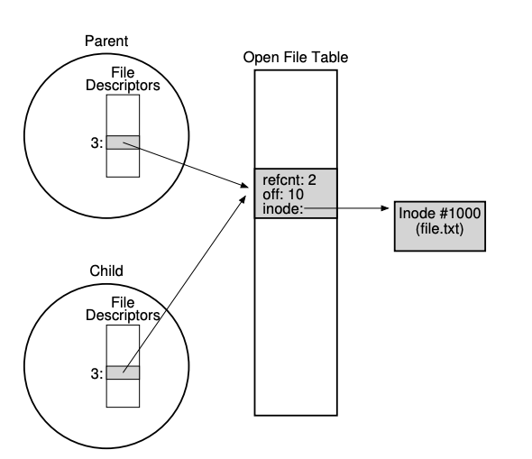

### Key Notes on Shared File Table Entries: `fork()` and `dup()`

#### 1. **File Descriptor and Open File Table Mapping**

- Typically, there is a **one-to-one mapping** between a file descriptor and an entry in the open file table.
- Each process accessing a file has its **own entry** in the open file table, ensuring independent logical reading/writing with separate offsets.

#### 2. **Shared Open File Table Entries with `fork()`**

- When a parent process creates a child process using `fork()`, the child inherits the parent’s file descriptors, which point to the **same open file table entry**.
- **Example Code:**
    
    ```c
    int main(int argc, char *argv[]) {
        int fd = open("file.txt", O_RDONLY);
        assert(fd >= 0);
        int rc = fork();
        if (rc == 0) {
            rc = lseek(fd, 10, SEEK_SET);
            printf("child: offset %d\n", rc);
        } else if (rc > 0) {
            (void) wait(NULL);
            printf("parent: offset %d\n", (int) lseek(fd, 0, SEEK_CUR));
        }
        return 0;
    }
    ```
    
- **Output:**
    
    ```
    child: offset 10
    parent: offset 10
    ```
    
- **Explanation:**
    - Both parent and child share the same open file table entry.
    - Changes to the file offset (e.g., via `lseek()`) by one process are visible to the other.

#### 3. **Reference Count in Shared File Table Entries**

- When a file table entry is shared, its **reference count** is incremented.
- The entry is removed only when **all processes** sharing it close the file or exit.

#### 4. **Use Cases for Shared Open File Table Entries**

- Useful for **cooperative processes** working on a shared task, such as writing to the same output file without additional coordination.

#### 5. **Shared Open File Table Entries with `dup()`**

- The `dup()` system call creates a **new file descriptor** that refers to the **same open file table entry** as an existing descriptor.
- **Example Code:**
    
    ```c
    int main(int argc, char *argv[]) {
        int fd = open("README", O_RDONLY);
        assert(fd >= 0);
        int fd2 = dup(fd);
        // now fd and fd2 can be used interchangeably
        return 0;
    }
    ```
    
- **Explanation:**
    - Both `fd` and `fd2` point to the same open file table entry and can be used interchangeably.
- **Use Case:**
    - `dup()` (and `dup2()`) is particularly useful in **UNIX shell programming** for tasks like **output redirection**.

#### 6. **Key Differences Between `fork()` and `dup()`**

- **`fork()`**: Shares open file table entries between parent and child processes.
- **`dup()`**: Creates a new file descriptor within the same process that refers to the same open file table entry.


#### 7. **Visual Representation**

- **Figure 39.3**: Illustrates the relationship between:
    - Each process’s private descriptor array.
    - The shared open file table entry.
    - The reference to the underlying file-system inode.

#### 8. **Practical Insights**

- Sharing file table entries can simplify inter-process communication and coordination.
- Reference counts ensure proper cleanup of shared resources when all processes are done.
