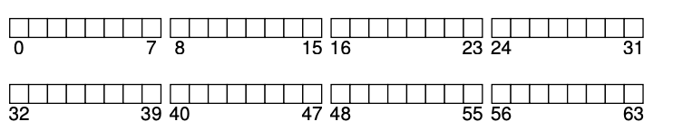
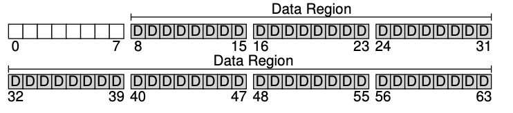
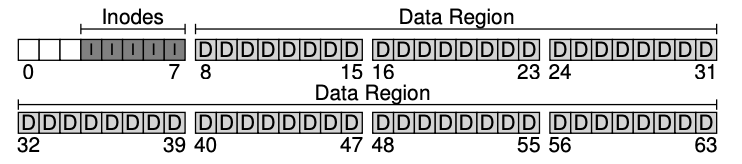
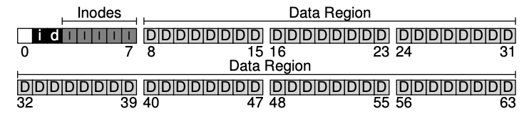
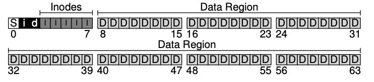

### Key Notes on VSFS File System Organization

#### 1. **Disk Partition and Block Size**

- Disk is divided into blocks of a fixed size (4 KB in this case).
- Blocks are addressed from `0` to `N-1` in a partition of size `N` blocks.
- Example: A small disk with 64 blocks, each 4 KB in size.


#### 2. **Data Region**

- Majority of the disk space is reserved for **user data**.
- **Data Region**: Last 56 blocks of the 64-block disk are allocated for user data.
- Layout:
    
    ```
    0-7: Reserved
    8-63: Data Region (D)
    ```
    


#### 3. **Inodes**

- **Inodes** store metadata about files, such as:
    - Data block pointers
    - File size
    - Owner and access rights
    - Access and modification times
- **Inode Table**: A fixed portion of the disk is reserved for inodes.
    - Example: 5 blocks (blocks 1-5) are allocated for inodes.
- Each inode is 256 bytes, so a 4 KB block can hold 16 inodes.
    - Total inodes in this example: `16 inodes/block × 5 blocks = 80 inodes`.
- Maximum number of files = Number of inodes.


#### 4. **Allocation Tracking**

- Allocation of inodes and data blocks is tracked using **bitmaps**:
    - **Inode Bitmap (i)**: Tracks whether inodes are free (0) or in-use (1).
    - **Data Bitmap (d)**: Tracks whether data blocks are free (0) or in-use (1).
- Each bitmap occupies a full 4 KB block for simplicity, even though it can track more objects than needed.


#### 5. **Superblock**

- The **superblock** (S) is reserved in block 0.
- Contains critical file system information:
    - Number of inodes and data blocks (e.g., 80 inodes, 56 data blocks).
    - Location of the inode table (e.g., starts at block 3).
    - Magic number to identify the file system type (e.g., vsfs).
- The operating system reads the superblock first when mounting the file system.


#### 6. **Final On-Disk Layout**

```
Block 0: Superblock (S)
Block 1: Inode Bitmap (i)
Block 2: Data Bitmap (d)
Blocks 3-7: Inode Table (I)
Blocks 8-63: Data Region (D)
```

#### 7. **Mounting the File System**

- The OS reads the superblock to initialize parameters and attach the volume to the file-system tree.
- When accessing files, the system uses the superblock to locate on-disk structures.