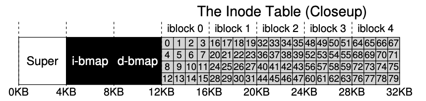

### Key Notes on File Organization: The Inode

#### Overview of Inode

- **Definition**: The inode (index node) is a critical on-disk structure in file systems, holding metadata about files.
- **Historical Context**: The term "inode" originates from UNIX and earlier systems like Multics. It was named "index node" because inodes were stored in an array and indexed for access.
- **Purpose**: Inodes store metadata about files, such as:
    - File length
    - Permissions
    - Location of data blocks
    - Ownership
    - Timestamps (creation, modification, access)
    - File type (e.g., regular file, directory)
    - Number of blocks allocated
    - Number of hard links
    - Group ownership
    - File version (used by NFS)
    - Access control lists (ACLs)
    - Disk pointers to data blocks

#### Inode Number (i-number)

- Each inode is identified by a unique number called the **i-number**.
- The i-number is used to calculate the location of the inode on the disk.

#### Inode Table and Disk Layout

- Inodes are stored in an **inode table** on the disk.
- Example (vsfs file system):
    - Inode table size: 20KB (5 blocks of 4KB each)
    - Each inode size: 256 bytes
    - Total inodes: 80
    - Inode table starts at 12KB on disk.
    - To locate an inode:
        - Calculate offset: `offset = i-number * sizeof(inode)`
        - Add offset to the start address of the inode table: `inodeStartAddr + offset`
        - Convert to sector address:
            
            ```
            blk = (i-number * sizeof(inode_t)) / blockSize;
            sector = ((blk * blockSize) + inodeStartAddr) / sectorSize;
            ```
            


#### Metadata Stored in an Inode

|**Size (bytes)**|**Field**|**Description**|
|---|---|---|
|2|`mode`|File permissions (read/write/execute).|
|2|`uid`|Owner of the file.|
|4|`size`|File size in bytes.|
|4|`time`|Last accessed time.|
|4|`ctime`|Creation time.|
|4|`mtime`|Last modified time.|
|4|`dtime`|Deletion time.|
|2|`gid`|Group ownership.|
|2|`links count`|Number of hard links to the file.|
|4|`blocks`|Number of blocks allocated to the file.|
|4|`flags`|Flags for how the inode is used by ext2.|
|4|`osd1`|OS-dependent field.|
|60|`block`|Disk pointers (15 total) to data blocks.|
|4|`generation`|File version (used by NFS).|
|4|`file acl`|New permissions model beyond mode bits.|
|4|`dir acl`|Access control lists.|

#### Data Block Pointers in Inodes

- **Direct Pointers**: Simple approach where the inode contains direct pointers to disk blocks.
- **Limitation**: Direct pointers limit the maximum file size to the block size multiplied by the number of pointers in the inode.

#### Key Design Considerations

- The design of the inode is crucial for file system efficiency.
- Metadata stored in the inode is essential for managing files and their associated data blocks.
- The inode structure must balance simplicity and scalability to handle files of varying sizes effectively.

#### Example: Ext2 Inode

- Ext2 inodes include fields for metadata and pointers to data blocks.
- Metadata includes file type, size, timestamps, ownership, permissions, and more.
- Disk pointers in the inode determine the location of the file's data blocks on the disk.