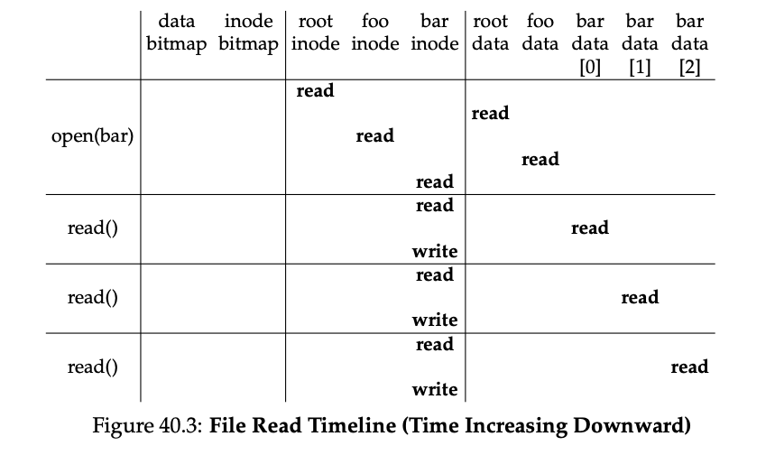

### Key Notes on "40.6 Access Paths: Reading and Writing"

#### **Understanding File System Access Paths**

- Access paths are crucial to understanding how a file system works during file read/write operations.
- The superblock is already in memory when the file system is mounted, but other components (e.g., inodes, directories) remain on disk.

---

#### **Reading a File from Disk**

1. **Opening a File**:
    
    - Example: `open("/foo/bar", O_RDONLY)`
    - The file system must locate the inode of the file (`bar`) to retrieve metadata (e.g., permissions, file size).
    - The process involves traversing the file path (`/foo/bar`) to locate the desired inode.
2. **Path Traversal**:
    
    - Traversal starts at the root directory (`/`), whose inode is well-known (commonly inode number 2 in UNIX file systems).
    - The file system reads the block containing the root inode and uses its pointers to locate the data blocks of the root directory.
    - It searches the root directory for the next component in the path (`foo`), retrieves its inode number (e.g., 44), and continues the traversal.
    - This process repeats until the inode of the target file (`bar`) is found.
3. **Reading the File**:
    
    - Once the inode of `bar` is in memory, the file system performs a permissions check.
    - A file descriptor is allocated in the per-process open-file table and returned to the user.
    - A `read()` system call reads the file's data blocks, starting at offset 0 (unless modified by `lseek()`).
    - The file system consults the inode to locate the data blocks and updates the inode's last-accessed time.
4. **Closing the File**:
    
    - When the file is closed, the file descriptor is deallocated.
    - No additional disk I/O is required during the close operation.




---

#### **Key Observations**

- The amount of I/O during `open()` is proportional to the length of the file path.
- Each directory in the path requires reading its inode and data blocks.
- Large directories may require reading multiple data blocks to locate the desired entry.
- Reading a file involves:
    - Locating the inode.
    - Reading the file's data blocks.
    - Updating the inode's last-accessed time.

---

#### **Performance Considerations**

- Longer file paths and larger directories increase the I/O overhead during file access.
- Writing or creating a new file is more complex and generates more I/O than reading a file.

---

#### **Code Example**

```c
// Example of opening a file in read-only mode
int fd = open("/foo/bar", O_RDONLY);
if (fd < 0) {
    perror("open");
    return -1;
}

// Example of reading from the file
char buffer[4096];
ssize_t bytesRead = read(fd, buffer, sizeof(buffer));
if (bytesRead < 0) {
    perror("read");
    close(fd);
    return -1;
}

// Example of closing the file
if (close(fd) < 0) {
    perror("close");
    return -1;
}
```

---

#### **Figure Reference**

- **Figure 40.3** (not provided in the context): Illustrates the sequence of operations during file access.
    - Time progresses downward in the figure.
    - Shows the reads required to locate the inode during `open()`.
    - Depicts the process of reading blocks and updating the inode's last-accessed time.


### Key Notes on "ASIDE: READS DON’T ACCESS ALLOCATION STRUCTURES"

#### **Understanding Allocation Structures in File Reads**

1. **Allocation Structures (e.g., Bitmaps)**:
    
    - Allocation structures like bitmaps are used to track free and allocated blocks in the file system.
    - These structures are **only accessed during block allocation** (e.g., when creating or extending a file).
2. **File Reads Do Not Use Allocation Structures**:
    
    - When reading a file, the file system does **not consult allocation structures** like bitmaps.
    - The inode, directories, and indirect blocks already contain all the necessary information to complete a read request.
    - There is no need to verify block allocation during a read operation because the inode already points to the allocated blocks.
3. **Common Misconception**:
    
    - Students often mistakenly believe that allocation structures are checked during file reads.
    - This is incorrect; allocation structures are irrelevant for read operations unless new blocks are being allocated.

---

#### **Code Example**

```c
// Example of reading a file without consulting allocation structures
int fd = open("/example/file", O_RDONLY);
if (fd < 0) {
    perror("open");
    return -1;
}

char buffer[1024];
ssize_t bytesRead = read(fd, buffer, sizeof(buffer));
if (bytesRead < 0) {
    perror("read");
    close(fd);
    return -1;
}

printf("Read %zd bytes from the file.\n", bytesRead);

if (close(fd) < 0) {
    perror("close");
    return -1;
}
```

---

#### **Key Takeaways**

- Allocation structures like bitmaps are **not involved in file read operations**.
- The inode and related metadata already provide the necessary information for reading data blocks.
- Allocation structures are only accessed when new blocks need to be allocated, such as during file creation or extension.