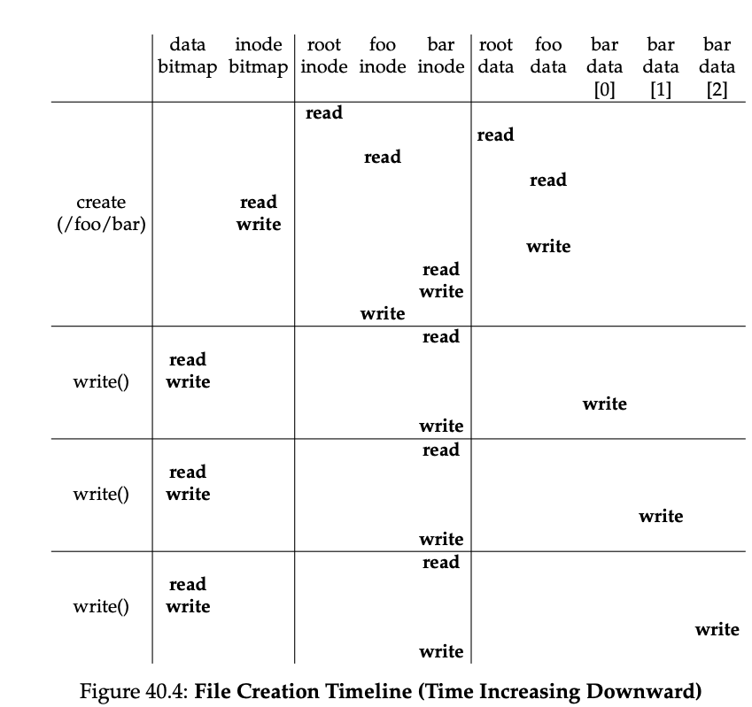

### Key Notes: Writing a File to Disk

#### Process of Writing to a File

1. **Opening the File**: The file must first be opened.
2. **Writing to the File**: The application issues `write()` calls to update the file with new contents.
3. **Closing the File**: The file is closed after the write operation.

#### Key Details of Writing to a File

- Writing to a file may **allocate a block** unless the block is being overwritten.
- Writing a new file involves:
    - Writing data to disk.
    - Deciding which block to allocate to the file.
    - Updating disk structures (e.g., data bitmap and inode).

#### Logical I/Os Generated During a Write Operation

Each write to a file generates **five I/Os**:

1. **Read the data bitmap** (to find a free block).
2. **Write the updated data bitmap** (to mark the block as used).
3. **Read the inode** (to update it with the new block’s location).
4. **Write the updated inode**.
5. **Write the actual block**.

#### File Creation: A High I/O Operation

- File creation involves additional I/O operations:
    1. **Read the inode bitmap** (to find a free inode).
    2. **Write the updated inode bitmap** (to mark the inode as allocated).
    3. **Write the new inode** (to initialize it).
    4. **Write to the directory data** (to link the file name to its inode number).
    5. **Read and write the directory inode** (to update it).
    6. If the directory needs to grow, additional I/Os are required (e.g., to the data bitmap and new directory block).

#### Example: Creating and Writing to a File `/foo/bar`

- **File Creation**:
    - 10 I/Os are required to walk the pathname and create the file.
- **Allocating Writes**:
    - Each allocating write costs **5 I/Os**:
        1. Read and update the inode (2 I/Os).
        2. Read and update the data bitmap (2 I/Os).
        3. Write the data itself (1 I/O).

#### Efficiency Challenges

- File systems must handle these operations efficiently despite the high number of I/Os involved in file creation and writing.