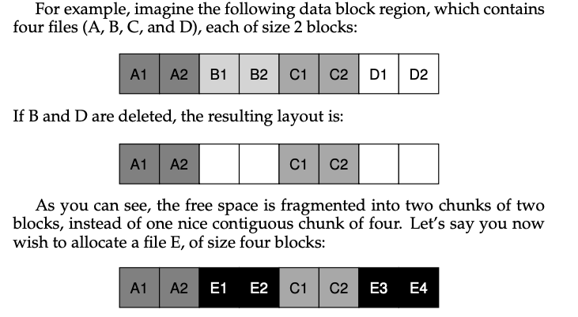

### Key Notes on the UNIX File System and Performance Issues

#### 1. **Old UNIX File System Overview**

- **Structure**:
    - **Superblock (S)**: Contains metadata about the file system (e.g., volume size, number of inodes, pointer to free block list).
    - **Inode Region**: Stores all inodes for the file system.
    - **Data Blocks**: Majority of the disk space is allocated to data storage.

- **Advantages**:
    - Simple design.
    - Supported basic abstractions like files and directory hierarchies.
    - Significant improvement over older, record-based storage systems and one-level hierarchies.

#### 2. **Performance Issues**

- **Poor Disk Bandwidth Utilization**:
    - Performance degraded over time, eventually delivering only 2% of the disk's overall bandwidth.
- **Random Data Placement**:
    - Disk treated like random-access memory, leading to data being scattered across the disk.
    - Data blocks of a file were often far from their corresponding inodes, causing expensive seek operations.
- **Fragmentation**:
    - Free space was poorly managed, leading to fragmented storage.
    - Example:
        - Initial layout: `A1 A2 B1 B2 C1 C2 D1 D2`
        - After deleting files B and D: `A1 A2 C1 C2`
        - Allocating a new file E (4 blocks): `A1 A2 E1 E2 C1 C2 E3 E4`
        - File E is fragmented, resulting in reduced sequential read performance.

- **Small Block Size**:
    - Original block size was 512 bytes.
    - Small blocks minimized internal fragmentation but caused inefficiency in data transfer due to high positioning overhead.

#### 3. **Key Problems**

- **Fragmentation**:
    - Files were not stored contiguously, leading to frequent seeks and reduced performance.
    - Disk defragmentation tools were later introduced to reorganize data and improve performance.
- **Inefficient Block Size**:
    - Small block sizes caused inefficiencies in data transfer.

#### 4. **The Crux of the Problem**

- **Main Challenge**:
    - How to organize on-disk data structures to improve performance.
- **Key Questions**:
    - What allocation policies are needed to optimize performance?
    - How can the file system be made "disk-aware" to account for the physical characteristics of disks?

#### 5. **Example of Fragmentation**

- **Initial State**: `A1 A2 B1 B2 C1 C2 D1 D2` (4 files, each 2 blocks).
- **After Deletion**: `A1 A2 C1 C2` (free space fragmented into two chunks of 2 blocks each).
- **New File Allocation**: `A1 A2 E1 E2 C1 C2 E3 E4` (new file E is fragmented, reducing performance).