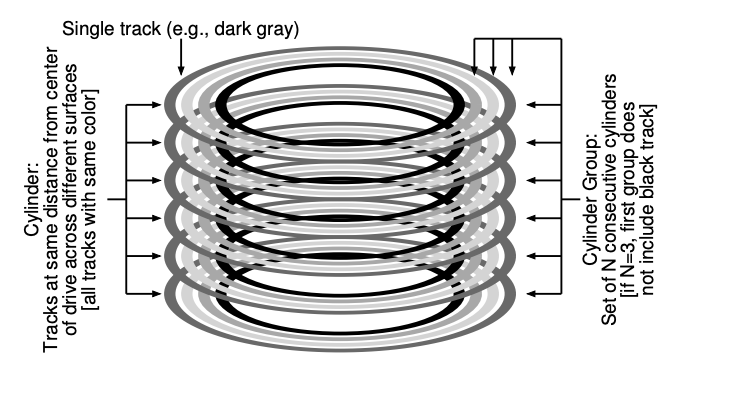

### Key Notes for Quick Review

#### **41.2 FFS: Disk Awareness Is The Solution**

- **Objective**: Berkeley developed the Fast File System (FFS) to improve file system performance by being "disk aware."
- **Key Approach**:
    - Retained the same file system interface (e.g., `open()`, `read()`, `write()`, `close()`).
    - Changed internal implementation to enhance performance and reliability.
- **Impact**:
    - Pioneered a new era of file system research.
    - Modern file systems maintain compatibility with existing APIs while optimizing internal structures.

---

#### **41.3 Organizing Structure: The Cylinder Group**

- **Disk Organization**:
    
    - FFS divides the disk into **cylinder groups**.
    - A **cylinder** is a set of tracks on different surfaces of a hard drive that are equidistant from the center.
    - **Cylinder groups** are formed by aggregating multiple consecutive cylinders.
    - Modern drives use **block groups** instead of cylinder groups due to logical address space abstraction.

- **Performance Optimization**:
    
    - Files within the same group are placed close together to minimize seek times.
    - Groups store files, directories, and metadata to improve access speed.
- **Components of a Cylinder Group**:
    
    1. **Superblock (S)**:
        - A copy of the superblock is stored in each group for reliability.
        - Used to mount the file system; multiple copies ensure recovery in case of corruption.
    2. **Inode Bitmap (ib)**:
        - Tracks allocated and free inodes within the group.
    3. **Data Bitmap (db)**:
        - Tracks allocated and free data blocks within the group.
    4. **Inode and Data Block Regions**:
        - Inodes store metadata about files.
        - Data blocks store the actual file data.

![[chapter-41-05.png]]

- Logically 

- **Advantages of Bitmaps**:
    
    - Efficiently manage free space.
    - Help allocate large chunks of free space, reducing fragmentation.

---

#### **FFS File Creation Example**

- **Scenario**: Creating a new file `/foo/bar.txt` (1 block long, 4KB).
    
- **Steps and Updates**:
    
    1. **Allocate a new inode**:
        - Update the **inode bitmap**.
        - Write the newly allocated inode to disk.
    2. **Allocate a data block**:
        - Update the **data bitmap**.
        - Write the data block to disk.
    3. **Update the parent directory (`foo`)**:
        - Add an entry for `bar.txt` in the directory.
        - Update the parent directory's inode:
            - Reflect the new directory length.
            - Update metadata (e.g., last-modified-time).
    4. **Total Writes**:
        - At least **4 writes** to the current cylinder group:
            - Inode bitmap.
            - Data bitmap.
            - Inode.
            - Data block.
        - Additional writes may occur if the parent directory requires a new block.
- **Takeaway**: File creation involves multiple updates to ensure consistency and proper organization, making it a complex process.
    

---