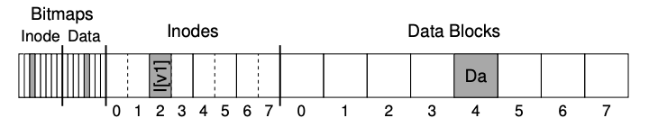

### Key Notes: A Detailed Example of Journaling

#### **Overview of the Example**

- **Workload**: Appending a single data block to an existing file.
    
    - Steps:
        1. Open the file.
        2. Use `lseek()` to move the file offset to the end of the file.
        3. Issue a single 4KB write to the file.
        4. Close the file.
- **File System Structures**:
    
    - **Inode Bitmap**: Tracks allocated inodes (8 bits, one per inode).
    - **Data Bitmap**: Tracks allocated data blocks (8 bits, one per block).
    - **Inodes**: 8 total, numbered 0 to 7, spread across 4 blocks.
    - **Data Blocks**: 8 total, numbered 0 to 7.


---

#### **Initial State of the File System**

- **Allocated Structures**:
    - **Inode Bitmap**: Inode 2 is allocated.
    - **Data Bitmap**: Data block 4 is allocated.
    - **Inode (I[v1])**:
        
        ```
        owner       : remzi
        permissions : read-write
        size        : 1
        pointer     : 4
        pointer     : null
        pointer     : null
        pointer     : null
        ```
        
        - File size is 1 block.
        - First direct pointer points to block 4 (data block `Da`).
        - Other pointers are `null`.

---

#### **Changes After Appending a New Data Block**

- **Updated Structures**:
    
    1. **Inode (I[v2])**:
        
        ```
        owner       : remzi
        permissions : read-write
        size        : 2
        pointer     : 4
        pointer     : 5
        pointer     : null
        pointer     : null
        ```
        
        - File size increases to 2 blocks.
        - Second direct pointer now points to block 5 (new data block `Db`).
    2. **Data Bitmap (B[v2])**:
        
        - Updated to reflect the allocation of the new data block.
        - New bitmap: `00001100`.
    3. **New Data Block (Db)**:
        
        - Contains the appended data (e.g., user data like music or files).
- **Final Desired On-Disk State**:
    
    ```
    Bitmaps
    Inode Bitmap:  0 1 2 3 4 5 6 7
    Data Bitmap:   0 1 2 3 4 5 6 7
    Inodes:        I[v2]
    Data Blocks:   Da Db
    ```
    

---

#### **Challenges in Writing to Disk**

- **Required Writes**:
    
    - Three separate writes are needed to update the disk:
        1. Write the updated inode (I[v2]).
        2. Write the updated data bitmap (B[v2]).
        3. Write the new data block (Db).
- **Write Timing**:
    
    - These writes do not occur immediately after the `write()` system call.
    - Updates are first stored in main memory (page cache or buffer cache).
    - The file system writes them to disk after a delay (e.g., 5–30 seconds).
- **Crash Consistency Problem**:
    
    - If a crash occurs after one or two writes but before all three are completed, the file system may be left in an inconsistent state.
    - Example of inconsistency:
        - The inode may point to a new data block that hasn’t been allocated in the data bitmap.
        - The data bitmap may indicate a block is allocated, but the inode doesn’t point to it.