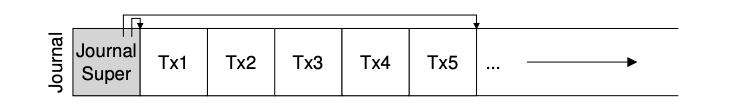

### Key Notes: Making the Log Finite

#### Overview of the Protocol

1. **Buffering Updates**: File system buffers updates in memory temporarily.
2. **Write-Ahead Logging**: Updates are written to a journal (write-ahead log) before being written to their final locations on disk.
3. **Checkpointing**: After a transaction is complete, the file system checkpoints the blocks to their final locations on disk.

---

#### Challenges with a Finite Log

1. **Log Size Limitation**:
    - The log has a finite size and can fill up if transactions are continuously added.
    - When full, no further transactions can be committed, rendering the file system unusable.
2. **Recovery Time**:
    - Larger logs increase recovery time as all transactions in the log must be replayed in order.

---

#### Solution: Circular Log

- **Circular Data Structure**: The log is reused by treating it as a circular data structure.
- **Freeing Space**:
    - After a transaction is checkpointed, the space it occupied in the journal is freed.
    - The journal superblock tracks the oldest and newest non-checkpointed transactions, marking other space as free.

---

#### Final Data Journaling Protocol

1. **Journal Write**:
    - Write the transaction contents (e.g., `TxB` and update contents) to the log.
    - Wait for the write to complete.
2. **Journal Commit**:
    - Write the transaction commit block (e.g., `TxE`) to the log.
    - Wait for the write to complete.
    - The transaction is now committed.
3. **Checkpoint**:
    - Write the update contents to their final locations in the file system.
4. **Free**:
    - Mark the transaction as free in the journal by updating the journal superblock.

---

#### Remaining Problem

- **Double Writing**:
    - Each data block is written to the disk twice (once to the journal and once to the final location).
    - This is resource-intensive, especially since system crashes are rare.
- **Open Question**:
    - How can consistency be retained without writing data twice?