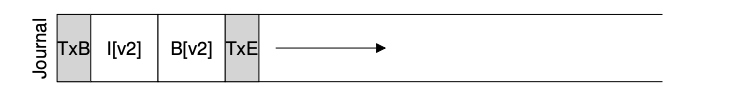

### Key Notes on Metadata Journaling

#### Overview

- **Metadata Journaling**: A method to ensure file system consistency by logging metadata updates in a journal before applying them to the main file system.
- **Performance Trade-off**: While recovery is faster (scanning the journal instead of the entire disk), normal operations are slower due to additional write traffic to the journal.

---

#### Types of Journaling

1. **Data Journaling**:
    
    - Logs both user data and metadata to the journal.
    - Results in double write traffic (data written to journal and then to the file system).
    - Slower performance, especially for sequential write workloads.
2. **Metadata Journaling (Ordered Journaling)**:
    
    - Logs only metadata to the journal, not user data.
    - Reduces I/O load by avoiding double writes for user data.
    - Commonly used in file systems like Linux ext3 (ordered mode), Windows NTFS, and SGI’s XFS.

---

#### Metadata-Only Journaling Process

- **Steps in Metadata-Only Journaling**:
    
    1. **Data Write**: Write data to its final location on disk; optionally wait for completion.
    2. **Journal Metadata Write**: Write the begin block and metadata to the journal; wait for completion.
    3. **Journal Commit**: Write the transaction commit block (TxE) to the journal; wait for completion. The transaction is now committed.
    4. **Checkpoint Metadata**: Write metadata updates to their final locations in the file system.
    5. **Free Transaction**: Mark the transaction as free in the journal superblock.
- **Key Rule for Crash Consistency**:
    
    - Write the pointed-to object (data block) before the object that points to it (metadata).
    - Ensures that metadata does not point to garbage data in case of a crash.

---

#### Considerations for Metadata Journaling

- **Data Write Ordering**:
    
    - Writing data blocks (e.g., Db) to disk before metadata ensures that metadata does not point to invalid or garbage data.
    - If metadata is written before data, a crash could result in a consistent file system with invalid data pointers.
- **Concurrency**:
    
    - It is not mandatory to wait for the data write (Step 1) to complete before starting the journal metadata write (Step 2).
    - However, both Steps 1 and 2 must complete before issuing the journal commit block (Step 3).

---

#### Popular File Systems and Modes

- **Linux ext3**:
    - Offers three journaling modes:
        1. **Data Journaling**: Logs both data and metadata.
        2. **Ordered Journaling**: Logs only metadata; data is written to disk before metadata.
        3. **Unordered Journaling**: Data can be written at any time.
- **Windows NTFS and SGI’s XFS**:
    - Use metadata journaling (similar to ordered journaling in ext3).