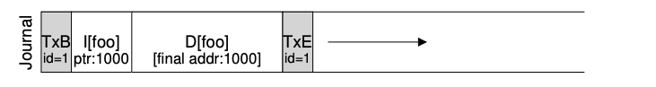
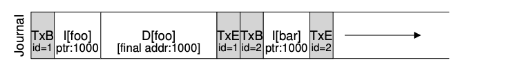
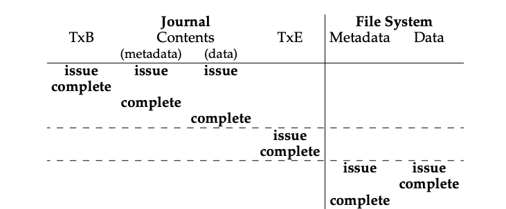

### Key Notes: Tricky Case - Block Reuse in Journaling

#### Overview

- **Journaling Complexity**: Deleting files is one of the most complex and error-prone operations in journaling systems, particularly due to block reuse.
- **Block Reuse Issue**: When a block is freed (e.g., by deleting a file) and then reused for new data, it can lead to data corruption during crash recovery if the journal replays outdated information.

---

#### Example Scenario

1. **Initial State**:
    
    - A directory `foo` is created, and its metadata (block 1000) is journaled.
    - Journal entry for `foo`:

1. **File Deletion and Block Reuse**:
    
    - The directory `foo` is deleted, freeing block 1000 for reuse.
    - A new file `bar` is created, and block 1000 is reused for its data.
    - Journal entry for `bar`:

2. **Crash Scenario**:
    
    - A crash occurs before the journal is fully checkpointed.
    - During recovery, the journal replays all entries, including the old directory data for block 1000.
    - This overwrites the new data of file `bar` with the old directory contents, leading to data corruption.

---

#### Solutions to the Problem

1. **Avoid Block Reuse**:
    
    - Do not reuse freed blocks until their deletion is checkpointed out of the journal.
    - This ensures that outdated data is not replayed during recovery.
2. **Revoke Records** (Used by Linux ext3):
    
    - Introduce a new type of journal record called a **revoke record**.
    - When a block is deleted, a revoke record is written to the journal.
    - During recovery, the system scans for revoke records and ensures that any revoked data is not replayed.
    - This prevents the overwriting of new data with old, invalid data.