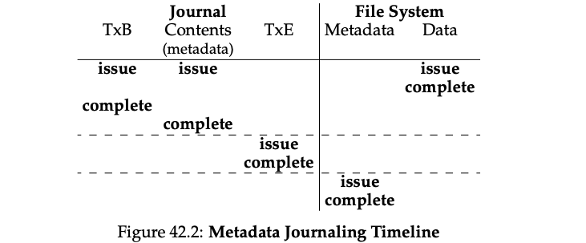

### Key Notes: Wrapping Up Journaling - A Timeline

#### **1. Overview of Journaling Protocols**

- Two types of journaling protocols are discussed:
    - **Data Journaling Protocol** (Figure 42.1): Journals both data and metadata.
    - **Metadata Journaling Protocol** (Figure 42.2): Journals only metadata.

#### **2. Timeline Representation**

- **Time Progression**: Time increases in the downward direction in the figures.
- **Logical Time**: Each row represents the logical time when a write can be issued or completed.

#### **3. Data Journaling Protocol (Figure 42.1)**

- **Write Order**:
    - **Transaction Begin Block (TxB)** and **Transaction Contents**: Can be issued simultaneously and completed in any order.
    - **Transaction End Block (TxE)**: Must not be issued until TxB and Transaction Contents are completed.
    - **Checkpointing Writes (Data and Metadata Blocks)**: Cannot begin until TxE has committed.
- **Write-Ordering Requirements**:
    - Horizontal dashed lines in the figure indicate where write-ordering must be enforced.

#### **4. Metadata Journaling Protocol (Figure 42.2)**

- **Write Order**:
    - **Data Write**, **Transaction Begin Block (TxB)**, and **Journal Contents**: Can be issued simultaneously.
    - **Data Write**: Must be issued and completed before the Transaction End Block (TxE) is issued.
- **Write-Ordering Requirements**:
    - Horizontal dashed lines indicate the necessary ordering for protocol correctness.

#### **5. Completion Time**

- **Arbitrary Completion Time**:
    - The completion time for each write is determined by the I/O subsystem.
    - The I/O subsystem may reorder writes to optimize performance.
    - The only enforced ordering is for protocol correctness, as shown by the dashed lines in the figures.

