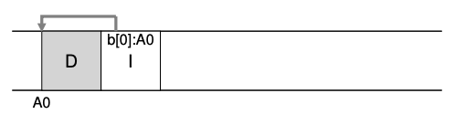

### Key Notes for Quick Review: Writing to Disk Sequentially (43.1)

1. **Challenge**:
    
    - Transform all updates to file-system state into a series of **sequential writes** to disk.
2. **Example**: Writing a data block `D` to a file:
    
    - Data block `D` is written to disk at address `A0`:
        
        ```
        | D |  
	      A0
        ```
        
3. **Metadata Updates**:
    
    - When a user writes a data block, **metadata** (e.g., inode) must also be updated.
    - Example: Writing the inode `I` to disk to point to the data block `D`:
        
    
        - `I` represents the inode.
        - `b[0]:A0` indicates that the first block of the inode points to address `A0`.
4. **Key Concept**:
    
    - The **Log-Structured File System (LFS)** relies on writing all updates (data blocks, inodes, etc.) **sequentially** to disk.
    - This approach simplifies the process of writing to disk but involves complex details in implementation.
5. **Additional Notes**:
    
    - Data blocks are typically **4 KB** in size.
    - Inodes are much smaller, usually around **128 bytes**.