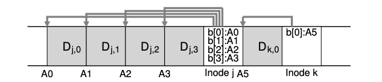

### Key Notes for Quick Review: Writing Sequentially and Effectively

1. **Sequential Writing Alone is Not Sufficient for Efficiency**:
    
    - Writing blocks sequentially to disk does not guarantee efficient performance.
    - Example:
        - Write block to address `A` at time `T`.
        - Write next block to address `A + 1` at time `T + δ`.
        - If the disk rotates between these writes, the second write will wait for most of a rotation (`Trotation - δ`) before being committed.
    - **Key Insight**: Writing sequentially in small increments can still lead to inefficiencies due to disk rotation delays.
2. **Solution: Write Buffering**:
    
    - **Write Buffering**: A technique where updates are first stored in memory and written to disk in large chunks.
    - This ensures efficient use of the disk by reducing the impact of rotational delays.
3. **Segments in LFS (Log-Structured File System)**:
    
    - LFS groups updates into a large chunk called a **segment**.
    - A segment is an in-memory buffer that accumulates updates before being written to disk.
    - Writing a large segment at once ensures efficient disk usage.
4. **Example of Write Buffering in LFS**:
    
    - **First Update**: Four block writes to file `j`.
    - **Second Update**: One block write to file `k`.
    - LFS buffers these updates into a segment (total of 7 blocks) and writes the entire segment to disk at once.
    
    ```plaintext
    Example:
    Segment 1:
    - File j: Block 1, Block 2, Block 3, Block 4
    - File k: Block 1
    Total: 7 blocks written to disk in one operation
    ```
    
5. **Key Takeaway**:
    
    - Writing in large, contiguous chunks (segments) is critical for achieving peak write performance on disks.
    - LFS uses in-memory buffering to group updates into segments before committing them to disk.

