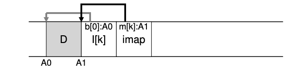
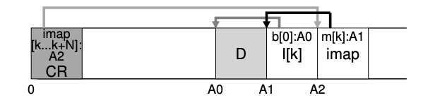

### Key Notes for Quick Review

#### **43.4 Problem: Finding Inodes**

- **Traditional UNIX File Systems (e.g., FFS):**
    
    - Inodes are stored in fixed locations on disk, organized in an array.
    - **Finding an inode:**
        - Use the formula:  
            `Disk Address = Start Address + (Inode Number × Size of Inode)`
        - Fast and straightforward due to array-based indexing.
    - **FFS Specifics:**
        - Inodes are split into chunks and placed in cylinder groups.
        - Requires knowledge of chunk sizes and start addresses, but calculations remain simple.
- **Log-Structured File System (LFS):**
    
    - Inodes are scattered across the disk.
    - Inodes are never overwritten in place; the latest version of an inode keeps moving.
    - This makes finding inodes more complex compared to traditional systems.

---

#### **43.5 Solution Through Indirection: The Inode Map**

- **Introduction of the Inode Map (imap):**
    
    - A data structure that maps an inode number to the disk address of its most recent version.
    - Often implemented as a simple array with 4 bytes (disk pointer) per entry.
    - **Update Process:**
        - When an inode is written to disk, the imap is updated with the inode's new location.
- **Persistence of the imap:**
    
    - The imap must be written to disk to ensure inode locations are tracked across crashes.
    - **Challenge:**
        - If the imap resides in a fixed disk location, frequent updates would lead to performance issues (e.g., increased disk seeks).
- **LFS Solution:**
    
    - Chunks of the imap are written alongside other new data.
    - When appending a data block to a file, LFS writes:
        1. The new data block.
        2. The inode of the file.
        3. A piece of the imap.
- **Example of LFS Write Process:**
    

    
    - **Explanation:**
        - `D`: Data block.
        - `A0`: Disk address of the data block.
        - `I[k]`: Inode of file `k`.
        - `b[0]:A0`: Inode points to the data block at address `A0`.
        - `A1`: Disk address of the inode.
        - `imap`: A piece of the inode map.
        - `m[k]:A1`: imap entry for inode `k` points to its disk address `A1`.

### Key Notes for Quick Review

#### **43.6 Completing the Solution: The Checkpoint Region**

- **Problem: Locating the Inode Map**
    
    - Since pieces of the inode map (imap) are scattered across the disk, there must be a fixed and known starting point to locate them.
    - Without a fixed reference, it would be impossible to find the inode map and, consequently, the inodes and data blocks.
- **Solution: The Checkpoint Region (CR)**
    
    - LFS introduces a **Checkpoint Region (CR)**, a fixed location on the disk that contains pointers (addresses) to the latest pieces of the inode map.
    - The CR is the starting point for file lookups in the file system.
    - The CR is updated periodically (e.g., every 30 seconds) to avoid performance degradation.
- **On-Disk Layout in LFS:**
    
    - The CR points to the latest pieces of the inode map.
    - The inode map pieces contain addresses of the inodes.
    - The inodes point to files and directories, similar to traditional UNIX file systems.
- **Example of the Checkpoint Region and On-Disk Layout:**

    
    - **Explanation:**
        - `CR`: Checkpoint Region, located at a fixed disk address (e.g., address `0`).
        - `imap [k...k+N]: A2`: The CR points to the disk address `A2`, where a chunk of the inode map is stored.
        - `D`: Data block.
        - `A0`: Disk address of the data block.
        - `I[k]`: Inode of file `k`.
        - `b[0]:A0`: Inode points to the data block at address `A0`.
        - `A1`: Disk address of the inode.
        - `imap m[k]:A1`: imap entry for inode `k` points to its disk address `A1`.

---

#### **Key Takeaways:**

- The **Checkpoint Region (CR)** is a fixed location on the disk that serves as the starting point for file lookups in LFS.
- The CR contains pointers to the latest pieces of the **inode map (imap)**, which are scattered across the disk.
- The imap pieces contain the addresses of inodes, and the inodes point to files and directories, similar to traditional UNIX file systems.
- The CR is updated periodically (e.g., every 30 seconds) to balance performance and reliability.

### Key Notes on "Use a Level of Indirection"

1. **Definition of Indirection**:
    
    - Indirection is a technique where an intermediate reference (or layer) is introduced to access or manage a resource indirectly rather than directly.
2. **Applications of Indirection**:
    
    - **Virtualization**:
        - Examples include **virtual memory** and the concept of a **file**.
        - Virtual memory uses indirection to map virtual addresses to physical memory locations.
        - Files abstract the underlying storage details, providing a logical view of data.
    - **Inode Map in LFS**:
        - The inode map in the Log-Structured File System (LFS) is an example of indirection.
        - It virtualizes inode numbers, allowing inodes to be moved freely without changing every reference to them.
3. **Advantages of Indirection**:
    
    - **Flexibility**:
        - Structures like pages (in virtual memory) or inodes (in LFS) can be moved or reorganized without affecting references.
    - **Abstraction**:
        - Indirection simplifies complex systems by hiding implementation details behind a layer of abstraction.
4. **Disadvantages of Indirection**:
    
    - **Overhead**:
        - Indirection introduces additional layers, which can lead to performance overhead.
    - **Too Many Indirections**:
        - Excessive use of indirection can make systems overly complex and inefficient.
5. **Famous Quote**:
    
    - As David Wheeler famously said:
        
        > "All problems in computer science can be solved by another level of indirection, except of course for the problem of too many indirections."
        
6. **Design Insight**:
    
    - When faced with a problem, consider whether adding a level of indirection can simplify the solution.
    - However, always evaluate the trade-offs, particularly the potential performance costs, before implementing indirection.