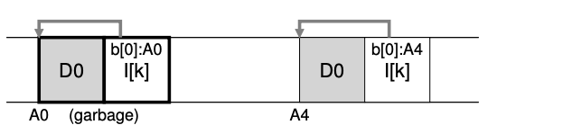
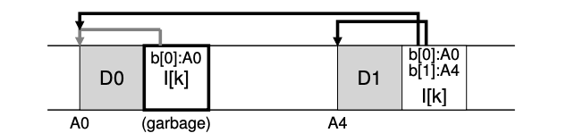

### Key Notes on "A New Problem: Garbage Collection" (Section 43.9)

1. **Problem with LFS: Garbage Accumulation**:
    
    - LFS writes new versions of files (including inodes and data) to new locations on disk.
    - This process leaves old versions of file structures scattered across the disk, referred to as **garbage**.
    - Example:
        - A file with inode `k` pointing to data block `D0` is updated:
            

            
            - The old inode and data block (`A0` and `D0`) become garbage, while the new inode and data block (`A4` and `D0`) are live.
2. **Appending Data to a File**:
    
    - When appending data to a file, the old data block remains live, but a new inode and data block are created:
        

        
        - The old data block (`A0`) is still live, but the old inode becomes garbage.
3. **Handling Garbage**:
    
    - **Versioning File Systems**:
        - Some file systems keep old versions of files, allowing users to restore previous versions.
    - **LFS Approach**:
        - LFS keeps only the latest live version of a file.
        - Old, dead versions of file data, inodes, and other structures are periodically cleaned in the background.
        - Cleaning frees up disk space for future writes.
4. **Garbage Collection in LFS**:
    
    - Cleaning is a form of **garbage collection**, similar to memory management in programming languages.
    - Cleaning ensures that blocks on disk are freed for subsequent writes.
5. **Role of Segments in Cleaning**:
    
    - Segments are critical for efficient cleaning and writing in LFS.
    - If the cleaner freed individual blocks, the disk would have scattered free spaces, reducing write performance.
    - Instead, the cleaner works **segment-by-segment** to free large contiguous regions for sequential writes.
6. **LFS Cleaning Process**:
    
    - The cleaner periodically:
        1. Reads a number of old, partially-used segments.
        2. Identifies which blocks within these segments are live and which are dead.
        3. Compacts the live blocks into a smaller number of new segments.
        4. Writes the new segments to disk in new locations.
        5. Frees the old segments for future writes.
    - Example:
        - The cleaner reads `M` old segments, compacts their live blocks into `N` new segments (`N < M`), writes the new segments, and frees the old `M` segments.
7. **Challenges in Garbage Collection**:
    
    - **Mechanism**: How does LFS determine which blocks in a segment are live and which are dead?
    - **Policy**: How often should the cleaner run, and which segments should it prioritize for cleaning?
8. **Key Takeaway**:
    
    - Garbage collection in LFS is essential to maintain write performance and free up disk space.
    - The segment-based cleaning approach ensures that large contiguous regions are available for efficient sequential writes.
    - Effective garbage collection requires both a robust mechanism to identify live blocks and a well-defined policy for when and how to clean.