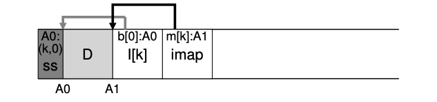

### Key Notes on "Determining Block Liveness" in LFS

1. **Purpose of Block Liveness Determination**:
    
    - LFS (Log-Structured File System) needs to determine whether a data block `D` in an on-disk segment `S` is live (in use) or dead (garbage).
2. **Mechanism for Determining Liveness**:
    
    - **Segment Summary Block**:
        
        - Each segment contains a segment summary block (SS) at its head.
        - The SS block stores metadata for each data block, including:
            - **Inode number (N)**: Identifies the file the block belongs to.
            - **Offset (T)**: Indicates the block's position within the file.
    - **Steps to Determine Liveness**:
        
        1. For a block `D` located at disk address `A`, look up the segment summary block to find its inode number `N` and offset `T`.
        2. Use the inode map (`imap`) to locate the inode `N` on disk (or in memory if already loaded).
        3. Check the inode (or indirect block) at offset `T` to see where the `T`th block of the file is stored on disk.
        4. If the inode points to disk address `A`, the block `D` is live.
        5. If the inode points elsewhere, the block `D` is dead (garbage).
    - **Pseudocode**:
        
        ```c
        (N, T) = SegmentSummary[A];
        inode = Read(imap[N]);
        if (inode[T] == A)
            // block D is alive
        else
            // block D is garbage
        ```
        
1. **Diagram Explanation**:

    
    - The segment summary block (SS) records metadata for each block.
    - Example:
        - Data block at address `A0` belongs to file `k` at offset `0`.
        - The imap for file `k` points to the inode `I[k]`.
        - The inode confirms that the block at offset `0` points to `A0`, verifying that the block is live.
3. **Optimizations for Efficiency**:
    
    - **Version Numbers**:
        - When a file is truncated or deleted, LFS increments its version number and records it in the imap.
        - The on-disk segment also stores the version number.
        - By comparing the on-disk version number with the imap version number, LFS can quickly determine if a block is live or dead without performing the full liveness check.

### Summary:

- LFS uses a **segment summary block** and **imap** to determine block liveness.
- The process involves checking the inode and offset to verify if a block is still in use.
- **Optimizations** like version numbers help reduce the overhead of liveness checks.