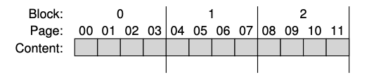

### Key Notes on Flash-Based SSDs

#### Overview of Flash-Based SSDs

- **Solid-State Storage**: Unlike traditional hard-disk drives (HDDs), SSDs have no mechanical or moving parts. They are built using transistors, similar to memory and processors.
- **Persistent Storage**: SSDs retain data even after power loss, making them ideal for long-term data storage.
- **Flash Technology**: The focus is on NAND-based flash, invented by Fujio Masuoka in the 1980s.
    - **Unique Properties**:
        - Writing to a flash page requires erasing an entire flash block, which is resource-intensive.
        - Repeated overwriting of a page can cause wear and reduce the lifespan of the device.

---

#### Key Challenges in Building Flash-Based SSDs

1. **Handling Expensive Erase Operations**: Writing to a page requires erasing the entire block, which is costly in terms of performance.
2. **Longevity**: Repeated overwrites can wear out the device, requiring strategies to extend its lifespan.

---

#### Storing a Single Bit in Flash

- **Bit Storage in Transistors**: Flash chips store data by trapping charge in transistors, which is mapped to binary values.
    - **Single-Level Cell (SLC)**: Stores 1 bit per transistor (1 or 0). High performance but expensive.
    - **Multi-Level Cell (MLC)**: Stores 2 bits per transistor (e.g., 00, 01, 10, 11). More cost-effective but slower.
    - **Triple-Level Cell (TLC)**: Stores 3 bits per transistor. Higher density but slower and less durable than SLC and MLC.

---

#### Flash Terminology

- **Blocks and Pages**:
    - **Blocks (Erase Blocks)**: Larger units, typically 128 KB or 256 KB in size.
    - **Pages**: Smaller units within blocks, typically a few KB in size (e.g., 4 KB).
    - A flash chip is organized into **banks/planes**, which consist of multiple blocks, and each block contains multiple pages.
- **Key Operation Detail**: To write to a page, the entire block containing the page must first be erased. This distinction between blocks and pages is critical for understanding flash operations and optimizing SSD performance.

---

#### Flash Operations and Challenges

- **Read and Write Operations**:
    - Reading data from flash is straightforward.
    - Writing data requires erasing the entire block first, which is time-consuming and impacts performance.
- **Performance and Durability**:
    - The erase-before-write requirement and wear-out issues make designing efficient and durable SSDs a challenge.
    - Engineers must develop strategies to manage these limitations effectively.

---

#### Additional Notes

- **Terminology Caution**: Terms like "blocks" and "pages" may have different meanings in different contexts (e.g., disks, RAIDs, virtual memory). It is crucial to understand and use the correct terminology within the specific domain.
- **Further Reading**: For deeper insights into the physics of bit-level storage in flash, refer to [J10].

---

#### Visual Representation

- **Flash Plane Example**:
    - A flash plane consists of multiple blocks, and each block contains multiple pages.
    - Example: A plane with 3 blocks, each containing 4 pages.

