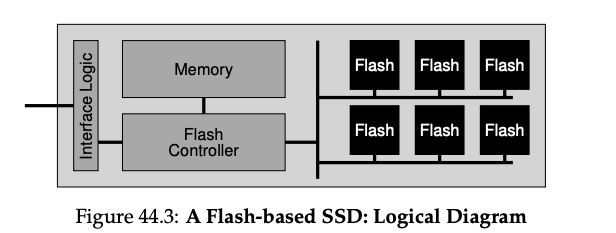

### Key Notes: From Raw Flash to Flash-Based SSDs

1. **Objective of Flash-Based SSDs**:
    
    - Convert raw flash chips into a standard block-based storage device.
    - Provide a block interface where blocks (sectors) of size 512 bytes (or larger) can be read or written using a block address.
2. **Components of an SSD**:
    
    - **Flash Chips**: For persistent storage.
    - **Volatile Memory (e.g., SRAM)**: Used for caching, buffering, and mapping tables.
    - **Control Logic**: Orchestrates device operations.
3. **Flash Translation Layer (FTL)**:
    
    - Converts logical block read/write requests into low-level flash operations (read, erase, program) on physical blocks/pages.
    - Goals:
        - **Performance**: Achieved through techniques like parallel usage of multiple flash chips and reducing write amplification.
        - **Reliability**: Ensured through wear leveling and minimizing program disturbance.
4. **Performance Optimization**:
    
    - **Parallelism**: Modern SSDs use multiple flash chips internally to improve performance.
    - **Write Amplification**:
        - Defined as:
            
            ```
            Write Amplification = (Total write traffic to flash chips) / (Total write traffic from client to SSD)
            ```
            
        - Naive FTL designs can lead to high write amplification, reducing performance.
5. **Reliability Techniques**:
    
    - **Wear Leveling**:
        - Spreads writes evenly across all blocks to prevent premature wear-out of specific blocks.
    - **Program Disturbance**:
        - Sequentially programs pages within an erased block (from low page to high page) to minimize disturbance.
6. **Key Challenges for FTL**:
    
    - Balancing performance and reliability.
    - Managing wear-out and program disturbance effectively.
7. **Additional Notes**:
    
    - Modern SSDs rely on advanced FTL designs to achieve high performance and reliability.
    - Reference: Agrawal et al. [A+08] for detailed insights.


