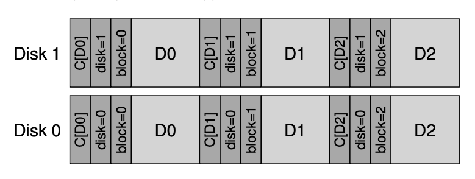

### Key Notes for Quick Review

#### **45.5 A New Problem: Misdirected Writes**

- **Definition**: Misdirected writes occur when data is written to the wrong location on a disk or RAID system.
    
    - Example: Block `Dx` is written to address `y` instead of `x`, corrupting `Dy`.
    - In multi-disk systems, data may be written to the wrong disk entirely (e.g., `Di,x` written to disk `j` instead of disk `i`).
- **CRUX: How to Handle Misdirected Writes**
    
    - **Solution**: Add a **physical identifier (physical ID)** to the checksum.
        - Include the **disk number** and **sector offset** in the checksum.
        - Example: For block `D10,4` (block 4 on disk 10), the checksum should include:
            - Data checksum: `C(D)`
            - Disk number: `10`
            - Sector offset: `4`
        - If the physical ID does not match during a read, a misdirected write is detected.

---

#### **45.6 One Last Problem: Lost Writes**

- **Definition**: Lost writes occur when a storage device reports a write as successful, but the data is not actually written to disk. The old block remains instead of the updated data.
    
    - **Issue**: Basic checksums and physical IDs cannot detect lost writes because:
        - The old block's checksum still matches.
        - The physical ID (disk number and block offset) remains correct.
- **CRUX: How to Handle Lost Writes**
    
    - **Solution 1**: Perform a **write verify** or **read-after-write**:
        - Immediately read back the data after writing to ensure it was written correctly.
        - **Drawback**: This approach doubles the number of I/O operations, making it slow.
    - **Solution 2**: Use **additional checksums** elsewhere in the system:
        - Example: **Zettabyte File System (ZFS)**:
            - Includes a checksum in each file system inode and indirect block for every block in a file.
            - If a data block write is lost, the checksum in the inode will not match the old data.
            - **Limitation**: If both the inode and data block writes are lost, the system fails (rare but possible).

---

#### **45.7 Scrubbing**

- **Definition**: Scrubbing is the process of periodically checking all data blocks in a storage system to ensure their integrity.
    - **Purpose**: Detect and prevent issues like **bit rot** (gradual data corruption) in rarely accessed data.
    - **How it works**:
        - The system reads through every block and verifies the checksum.
        - If a checksum mismatch is detected, the system can take corrective action.
    - **Frequency**: Typically scheduled on a **nightly** or **weekly** basis.

---

### Summary of Key Solutions

1. **Misdirected Writes**:
    
    - Add **physical identifiers** (disk number and sector offset) to checksums.
    - Verify the physical ID during reads to detect misdirected writes.
2. **Lost Writes**:
    
    - Use **write verify** or **read-after-write** (slower but effective).
    - Add **checksums in metadata** (e.g., ZFS inodes) to detect mismatches.
3. **Scrubbing**:
    
    - Periodically read and verify all blocks in the system to prevent undetected data corruption (e.g., bit rot).